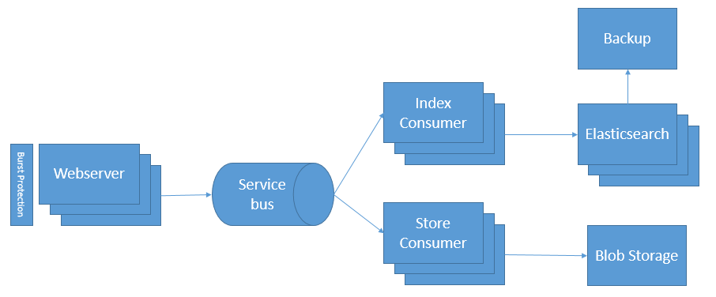

# Building a salable architecture to handle millions of errors

##### [Thomas Ardal](http://elmah.io/about/), September 5. 2015

You may take it for granted, but building an architecture which is able to scale to millions of messages isn’t something that comes overnight. elmah.io is built to handle lots and lots of messages by utilizing some of the nice features of Windows Azure. In this post we’ll show you how we’ve designed elmah.io to consume errors from our customers.

During the last 1½ years, we’ve continuously improved our architecture to handle an increasing load. Like every other startup, we didn’t have the perfect architecture from day one. But we learned from our mistakes and now have a scalable architecture, which is able to handle our customer’s data. A picture is worth a thousand words, and that is why looking at a diagram is probably the best way to explain our architecture:

The diagram illustrates the message flow from receiving a message (typically an error) from a customer, until the entire thing is persisted in the backend. We have a few components for handling emails and business rules that are not included in the diagram in order to keep it simple.

All messages are received through our [API](https://elmah.io/api/v2). The API is running as part of the elmah.io web application as an Azure Website. Azure Websites have a nice scaling feature, which makes it possible to increase the number of instances dynamically, based on the load on the web server. Since we don’t do much other than send messages to the service bus, we rarely need to scale the number of webservers, but in situations where one of our customers experience a DDOS attack, they may indirectly start DOS attacking us by sending a lot of errors to the elmah.io API. In these situations, scaling this number of websites is extremely important, to avoid the remaining customers being punished by a single DDOS. We rely on Windows Azures to load balancers to handle any DDOS attacks and we’ve implemented our own Burst Protection feature which only logs some of the errors, if thousands and thousands of messages are received from the same customer within a short period of time.

The reason for our API being fast, is caused by the fact that all messages are handled asynchronously. We use Azure Service Bus to handle messages, since that supports a publish/subscribe setup where multiple subscribers can consume the same message. We have multiple consumers able to store messages in various data stores, send mails, etc. All of our consumers are able to run in multiple instances, which makes it easy to spin up new consumer instances if the system has a hard time getting all of the messages processed. At the moment we have two consumers indexing data in Elasticsearch, but it can be a different number if you ask us a week from now.

Most of the features on elmah.io are based on searches in the awesome full-text server Elasticsearch. Elasticsearch is able to index millions of documents and make them searchable with query performance in few milliseconds. We use Azure Virtual Machines to host Elasticsearch and like the rest of the architecture, we can scale the number of nodes in the cluster depending on the need. Scaling of Elasticsearch nodes is not something we do automatically, but we continuously monitor the system and scale when needed. A single Elasticsearch node can handle a large amount of documents, but by replicating across multiple nodes, it makes it possible to do maintenance on a single node, without any down time for the end user.

Elasticsearch is backed up daily, using the [Azure plugin](https://github.com/elastic/elasticsearch-cloud-azure) for Elasticsearch and Azure Blob Storage. This way we are able to restore one or more indexes, if something goes really bad.

Alongside Elasticsearch, we also store all messages in Azure Blob Storage. We like the idea of keeping customer data in at least two data stores. In cases where Elasticsearch data is lost and the backup cannot be used to restore the indexes, we are able to restore everything from Azure Blob Storage. Luckily we’ve never actually needed to use data in Blob Storage, but having the data makes it a lot easier to sleep at night :) Blob Storage is a nice place to store data since it’s highly scalable and geo replicated.

That wraps it up. We’ve done everything in our power to make elmah.io scalable. Using a solution like Windows Azure where something that we thought a lot about when launching. It seemed expensive at the time, but when looking back, we would’ve used a lot more developer hours in order to achieve the same scalable architecture using a homemade setup on cheap virtual machines somewhere else.

### Future

We are quite confident that our current architecture will handle the increased load for at least a year, but as we see an increase in customers, we also will see increase in data. Since we don’t want to sit our hands waiting for accidents to happen, we are already working to improve the architecture even more. In the next version of the API (version 3) we want to split the website and API in two parts. This would allow our website to be down, without the API being affected.

We also want to look more into the Traffic Manager in Windows Azure, which makes it possible to scale websites across multiple regions. This improves response time for our customers, since web requests are handled by the nearest data center.

A third improvement could be to our service bus, which potentially can be a bottleneck in our current architecture. We are working on multiple ways to address this. One thing is to collect failing requests to the elmah.io API in the .NET client. In fact we already implemented this in the [latest prerelease](https://www.nuget.org/packages/elmah.io/2.1.6-beta). Another area could be to scale Service Bus or switch to another messaging technology like RabbitMQ. But since a service bus is the least of our worries at the moments, changes to this component probably won’t be the first to see the light of day.

