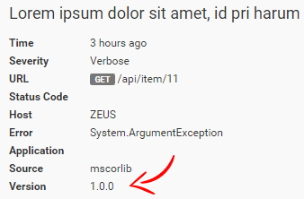
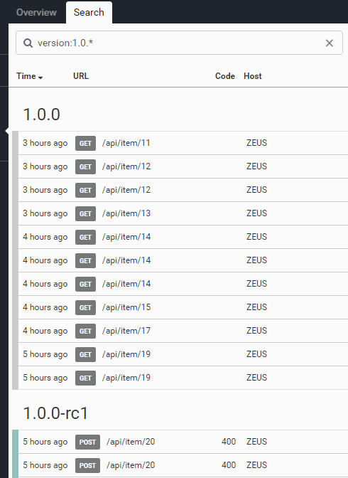

# Adding Version Information to your Log

##### [Thomas Ardal](http://elmah.io/about/), March 29, 2016

Time for a new crisp feature on elmah.io. All software applications have a version number (or at least should have). Being able to distinguish one version from the other is important. That's why we have implemented version number support on elmah.io.

Basically, there's a new version property on the message details:



The idea here is that you set this version number to the current version number of your application through appSettings, assembly version or similar.

Having a version number on all messages, lets you do funky searches like this:



To add a version number on all of the messages logged to elmah.io, add the following code somewhere during initialization:

```csharp
Elmah.ErrorLog.GetDefault(null); // Forces creation of logger client
var logger = ErrorLog.Client;
logger.OnMessage += (sender, args) =>
{
    args.Message.Version = "1.2.3"; // Requires elmah.io.core version >= 2.0.26
}
```

I addition to setting the version number through the `OnMessage` event, there are alternatives as well as support for logging frameworks like log4net, NLog and Serilog. Check out the [Adding Version Information](http://docs.elmah.io/adding-version-information/) article on our documentation site for more details.
