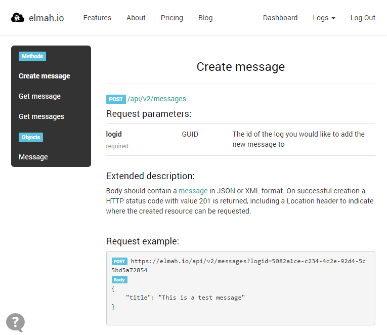

# API v2 Beta Released

##### [Thomas Ardal](http://elmah.io/about/), December 9, 2014 in [Tutorials](/category/tutorials/)

At elmah.io we believe in open APIs. That’s why we have offered an API to create errors and query them pretty much from the day of the first alpha. Unfortunately the API have been very tight coupled with ELMAHs ErrorXml format, which makes it hard to integrate to elmah.io without having extensive knowledge about the internals of ELMAH itself. Well, not anymore! Please welcome the API v2 beta.

So why a new API at all? As mentioned in the beginning, logging to the elmah.io V1 API requires you to generate a body containing the error in ELMAHs error XML format. While it would be possible to generate the XML by hand, you would probably always end up referencing the [elmah.corelibrary](http://www.nuget.org/packages/elmah.corelibrary/) NuGet package which contains strongly typed classes to actually generate the XML. If you are logging to ELMAH from an ASP.NET website, you are already referencing elmah.corelibrary, but if you want to log messages to elmah.io from something else, you probably don’t want to reference packages dependent of System.Web.



So how does the new API differ? First of all we’ve switched to JSON and a much purer REST implementation. Second, the error XML have been replaced with a custom format which we simply call [Message](https://elmah.io/api/v2#messageObject). A message is unlike Error from V1, simply a wrapper for logging and retrieving data to and from elmah.io. ELMAH doesn’t contain the concept of a severity like most other logging frameworks. This is not a bug, but caused by the fact that ELMAH focuses around errors. Message has the concept of severity which means that you can start logging other types of information to elmah.io like Debug and Information.

For now, check out the new [API V2 documentation](https://elmah.io/api/v2) and check out the [example](https://github.com/elmahio/Elmah.Io.Examples/tree/master/Elmah.Io.Examples.ApiClient.V2). In the next month, we will improve the support for severities on the elmah.io website as well as release a strongly typed client for the v2 API (preview available [here](http://teamcity.codebetter.com/viewLog.html?buildId=139846&buildTypeId=ElmahIo_ElmahIoV2&tab=artifacts)). When we feel comfortable about the new API, we will switch the [elmah.io client](http://www.nuget.org/packages/elmah.io/) to use the new API as well.


