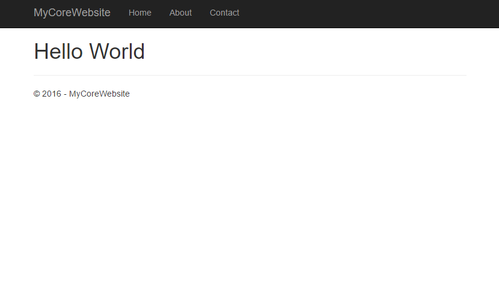

---
description: While ASP.NET Core doesn't have a web.config file, specifying application specific settings is supported through an external JSON file.
image: images/new_aspnetcore_website.png
booksignup: true
---

# AppSettings in ASP.NET Core

##### [Thomas Ardal](http://elmah.io/about/), October 24, 2016

Most parts of elmah.io consist of small services. While they may not be microservices, they are in fact small and each do one thing. We recently started experimenting with ASP.NET Core (or just Core for short) for some internal services and are planning a number of blog posts about the experiences we have made while developing these services. This is the first part in the series about the configuration system available in Core.

Core doesn't have the concept of `appSettings`, `connectionStrings` and other known features from ASP.NET. In fact configuration isn't even located in web.config. Let's create a new Core website in Visual Studio, to have a website to play with throughout the series:



When creating the website from the template, you will get a bunch of files generated. The interesting file in this context is named `appsettings.json`. `appsettings.json` is meant to replace settings previously located in `web.config`, but the file could have been named anything. In fact Core supports both JSON, XML and ini files. To tell Core about this configuration file, a couple of lines have been added to the `Startup.cs` file when generating the project:

```csharp
var builder = new ConfigurationBuilder()
    .SetBasePath(env.ContentRootPath)
    .AddJsonFile("appsettings.json", optional: true, reloadOnChange: true)
    .AddJsonFile($"appsettings.{env.EnvironmentName}.json", optional: true)
    .AddEnvironmentVariables();
Configuration = builder.Build();
```

Notice how the `appsettings.json` file is added to the `ConfigurationBuilder`. Also pay attention the line following that, adding another JSON file named `appsettings.{env.EnvironmentName}.json`. We will get back to this file in the next post.

To add application settings to the application, open `appsettings.json` and add the following lines before the `Logging` part already there:

```json
"AppSettings":{
    "Hello": "World"
},
"Logg...
```

Unlike settings in `web.config`, configuration in `appsettings.json` can be hierarchical. We use this to define a new section called `AppSettings` with a key called `Hello`. Both `AppSettings` and `Hello` could have been named anything we'd like.

Core uses an options pattern to resolve settings from `appsettings.json`. To read the `Hello` setting from the configuration file, add the following line to the `ConfigureServices`-method in `Startup.cs`:

```csharp
var appSettings = Configuration.GetSection("AppSettings");
```

This tells Core to read the `AppSettings` object from `appsettings.json`. Core is heavily based on dependency injection, why you no longer want to call `ConfigurationManager` from within your code. Instead you inject various options in your controllers. To register `AppSettings` in the container, create a new C# class representing the settings:

```csharp
public class AppSettings
{
    public string Hello { get; set; }
}
```

Then register the settings in the container by adding the following line to `Startup.cs` (just after the call to `GetSection`):

```chsarp
services.Configure<AppSettings>(appSettings);
```

This tells the Core container to register the class of type `AppSettings` with the configuration section resolved from `appsettings.json`.

Now that we have settings in the container, injecting them into a controller is easy using the options pattern. Add a constructor to the HomeController looking like this:

```chsarp
private readonly AppSettings _appSettings;

public HomeController(IOptions<AppSettings> appSettings)
{
    _appSettings = appSettings.Value;
}

```

We inject an instance of `IOptions` with a generic type of `AppSettings`, which we just saw in `Startup.cs`. To utilize the `Hello` option, we'll send the value of `Hello` to the model in the `Index`-method:

```chsarp
public IActionResult Index()
{
    ViewBag.Hello = _appSettings.Hello;
    return View();
}
```

And finally show the value in `View.cshtml`:

```html
@{
    ViewData["Title"] = "Home Page";
}

<h1>Hello @ViewBag.Hello</h1>
```

The result is somewhat not surprising:



In the next post, we'll discuss how to [switch configuration based on environments](/config-transformations-in-aspnetcore.md).