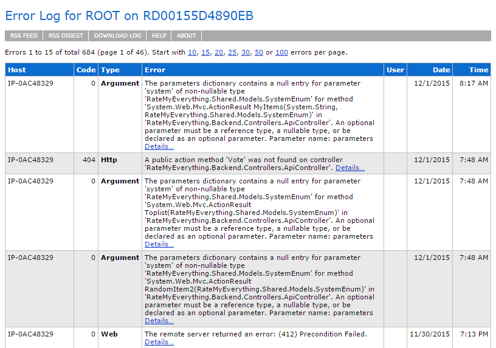

# ASP.NET Error Logging Best Practices

##### [Thomas Ardal](http://elmah.io/about/), December 1, 2015

Adding error logging to an ASP.NET application can be quite the challenge. A lot of different tools and frameworks are available. Everyone probably know log4net, but a lot happened since the first .NET logging frameworks where conceived. This post will show you the best practices which will provide you with vital information about errors happening on your website.

## ELMAH

Error logging module and handlers for ASP.NET ([ELMAH](https://elmah.github.io/)), the de-facto standard error component for .NET. ELMAH has existed for almost a decade but still works as wonderful as when it was initially released. The idea behind ELMAH is to log all uncaught exceptions including a lot of contextual information about the current HTTP context. ELMAH comes with a simple UI which shows you a list of errors happening and when, as well as some additional information like the type of error, the user causing the error and more.



> Since the ELMAH UI is available on `/elmah.axd`, make sure to either disallow remote access to this URL or configure ASP.NET authorization rules to only let people inside the circle of trust to access your error logs.

You can click each error and check out information about the server variables, cookies and other pieces of information, important to debug each error. ELMAH may not be the most hyped logging framework out there, but it works and it works great. We wouldn't implement a website without it.

> An important note about ELMAH is to use the contrib package, matching the web framework you're using. If you develop an ASP.NET MVC application, use the [Elmah.Mvc](https://www.nuget.org/packages/Elmah.MVC/) package. If you develop a Nancy application, use the [Nancy.Elmah](https://www.nuget.org/packages/Nancy.Elmah/) package etc.

To start using ELMAH, check out our [ELMAH Tutorial](/elmah-tutorial).

## Serilog

ELMAH only logs errors, why you probably need another logging framework to log other types of log messages like debug, information and warning messages. In theory, you could use ELMAH for other types of messages, but other logging frameworks are better suited for that need. Everyone knows log4net and NLog, but the logging framework we would like to highlight is [Serilog](http://serilog.net/). Serilog is a newer framework and therefore uses some of the more recent ideas behind logging as well as new libraries in .NET.

The idea behind Serilog is that your log messages are semantic/structured, which means that Serilog actually understands pieces of information inside your log message. Where a typical log message in log4net or NLog would look like this:

`Executed /getuser in 15 ms`

an equivalent log message in Serilog would look like this:

`Executed {Url} in {Elapsed} ms`

You would then append the actual values of `Url` and `Elapsed` when logging the message to Serilog. What looks to be a simple string replace, is actually as very strong feature, where log messages suddently embeds vital and searchable information.

Serilog implement the idea of destructoring by allowing you to log complex types to your log destinations. In theory, having the flexibility to log every .NET object seems like an awesome option. In the real world you should be very careful when logging complex objects with deep graph of references.

Using Serilog with a text file or relational database can be fine for testing purposes. If you want the full potential from Serilog, you need to log into a schemaless datastore like Elasticsearch, elmah.io or similar.

> When logging very complex objects to schemaless data stores like Elasticsearch, your mapping quickly becomes cluttered and performs poorly.

To start using Serilog, browse through the [Serilog wiki](https://github.com/serilog/serilog/wiki). Also make sure to check out our Serilog sink for [logging to elmah.io from Serilog](http://docs.elmah.io/logging-to-elmah-io-from-serilog/).

## Custom error pages

Depending on how you setup your custom error pages, ELMAH and other logging frameworks may stop working. If your custom error pages actually catches the error and continues like no error happened, logging frameworks may never get notified about something bad happening.

> A good rule of thumb is to configure custom error pages as close to the IIS as possible. The closer you get to the actual ASP.NET pipeline, the more likely your error logging falls apart.

There's a lot of outdated tutorials on custom error pages out there. For the ultimate guide, read Dustin Moris Gorskis [Demystifying ASP.NET MVC 5 Error Pages and Error Logging](http://dusted.codes/demystifying-aspnet-mvc-5-error-pages-and-error-logging).

