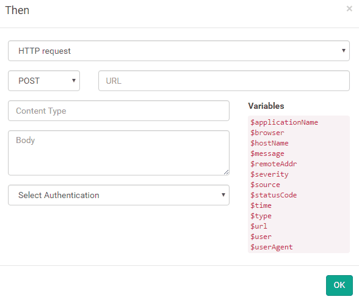

# Authentication in HTTP rules

##### [Thomas Ardal](http://elmah.io/about/), October 13, 2016

Since [introducing the elmah.io rule engine](/elmah-io-20131227-released/) almost 3 years ago, a lot of new features have been added and built on top of rules - one being the [elmah.io App Store](https://elmah.io/features/appstore). While it's possible to hide, ignore and mail errors using rules, most of you use rules to integrate elmah.io with external systems like Slack and HipChat.

Having to integrate with an external API pretty much always require some sort of authentication. Rules haven't really supported this in a good and consistent way. Until now! We just implemented support for bearer tokens (OAuth 2) and with the basic authentication support added a month ago, we support most scenarios needed to integrate elmah.io with another system providing a public REST API.



To start using Rules, check out [Creating rules to performance actions on messages](http://docs.elmah.io/creating-rules-to-perform-actions-on-messages/). Also make sure to look through the [documentation site](http://docs.elmah.io/) for help on installing the range of apps. You can even [create your own apps](http://docs.elmah.io/creating-apps-for-elmah-io/), using nothing more than a simple JSON file.