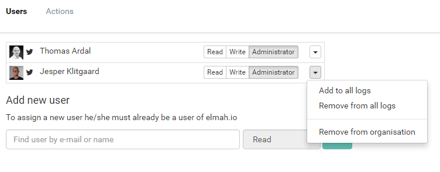

# Bulk managing users in an organisation

##### [Thomas Ardal](http://elmah.io/about/), August 10, 2016

A little over a month ago, we introduced the highly requested feature [Organisations](/organization-support). With organisations, you can manage all of the users within your company at the organisation level, rather than having to add the same user multiple times.

Today we introduce a new drop down on the organisation settings, which will allow for even easier administration of the users in your organisation. When adding a new user to the organisation, you probably want to assign the user to the logs inside your organisation, right? Using the new drop down, you will be able to both add and remove the user from all logs:



Please let us know what you think about the new bulk actions, as well as the organisation support on elmah.io.