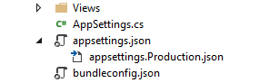
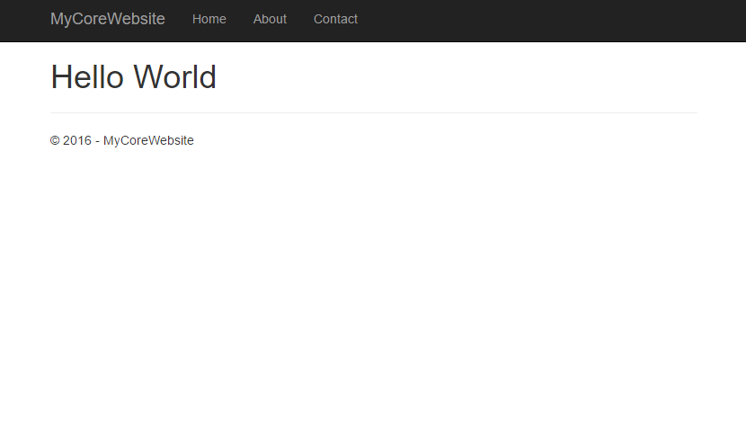
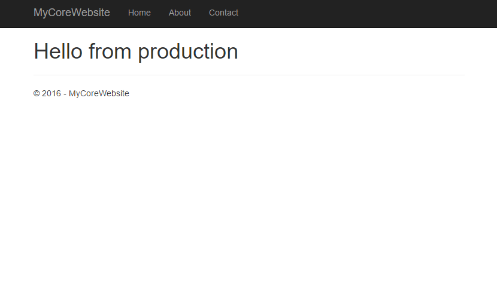

# Config transformations in ASP.NET Core

##### [Thomas Ardal](http://elmah.io/about/), October ?, 2016

Most parts of elmah.io consist of small services. While they may not be microservices, they are in fact small and each do one thing. We recently started experimenting with ASP.NET Core (or just Core for short) for some internal services and are planning a number of blog posts about the experiences we have made while developing these services. This is the second part in the series about the configuration system available in Core. If you haven't already, read through [AppSettings in ASP.NET Core](/appsettings-in-aspnetcore.md).

You probably know web.config transformations available in ASP.NET. Using a transform XML file, you can replace, insert, remove settings from any XML file. Transformations is primarily used to have sets of variables for different environments like localhost, staging and production. Since Core no longer use `web.config`, web.config transformations no longer apply. Luckily, Core introduces a similar concept for its JSON configuration files.

Let's extend the example from the [previous post](/appsettings-in-aspnetcore.md). To define another set of variables for the production environment, create a new JSON file named `appsettings.Production.json`. Notice how the new file is automatically nested beneath `appsettings.json` (previously this would require an extension for VS):



The nice thing about transformations in Core is, that you are no longer required to write cryptic xdt attributes. By specifying sections and variables with the same names as `appsettings.json`, Core automatically replaces the values.

To override the value of the `Hello` setting, add the following to `appsettings.Production.json`:

```json
{
  "AppSettings": {
    "Hello": "from production"
  }
}
```

Verify that `appsettings.{env.EnvironmentName}.json` is registered in `Startup.cs`:

```csharp
var builder = new ConfigurationBuilder()
    .SetBasePath(env.ContentRootPath)
    .AddJsonFile("appsettings.json", optional: true, reloadOnChange: true)
    .AddJsonFile($"appsettings.{env.EnvironmentName}.json", optional: true)
    .AddEnvironmentVariables();
Configuration = builder.Build();
```

This tell Core to first load `appsettings.json` and then a settings file of the same name, but with the current environment as part of the file name. So how does Core resolve `env.EnvironmentName`? Simply by looking at an environment variable named `ASPNETCORE_ENVIRONMENT`.

> `ASPNETCORE_ENVIRONMENT` were called `ASPNET_ENV` up until the rename of Core. You will still find a lot of blog posts referring to the old name.

If no environment variable with that name is found, Core automatically uses the value `Production`. Let's start the project to see the value used in the web app:



Wait a minute. We just added the `appsettings.Production.json` file and I told you that a value of `Production` is used if no environment variable named `ASPNETCORE_ENVIRONMENT` is specified. Why don't we see the value of `from production` then? Say hello to `launchSettings.json`. The `launchSettings.json` file (located in the `Properties` folder) contains a list of different profiles used to tell Visual Studio how to host and run your website. I won't go into more details about `launchSettings.json` in this post but in short, the profiles end up in this dropdown:


By right clicking the project and selecting _Properties_ or by simply opening `launchSettings.json`, you will see the list of profiles:

```json
{
  ...
  "profiles": {
    "IIS Express": {
      "commandName": "IISExpress",
      "launchBrowser": true,
      "environmentVariables": {
         "ASPNETCORE_ENVIRONMENT": "Development"
      }
    },
    "WebApplication14": {
      "commandName": "Project",
      "launchBrowser": true,
      "launchUrl": "http://localhost:5000",
      "environmentVariables": {
        "ASPNETCORE_ENVIRONMENT": "Development"
      }
    }
  }
}
```

Both profiles define an environment variable named `ASPNETCORE_ENVIRONMENT` with the value of `Development`. Since we don't have a file named `appsettings.Development.json`, the default values in `appsettings.json` is used.

To test the production variables, replace the value of `ASPNETCORE_ENVIRONMENT` with `Production` and restart the browser:



In the next post, we'll discuss how to deploy ASP.NET Core with transformations to Azure.