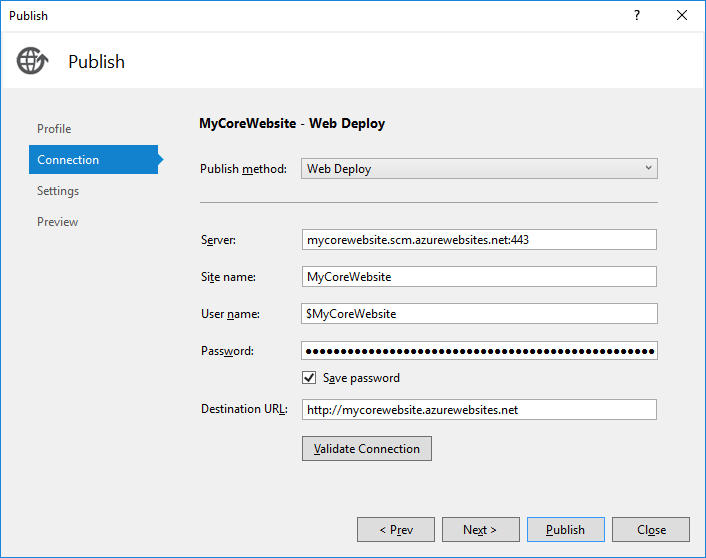
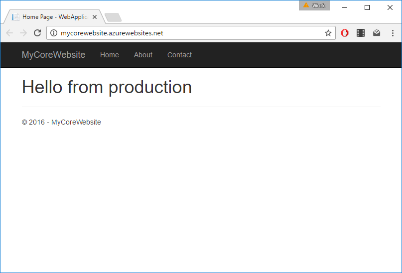
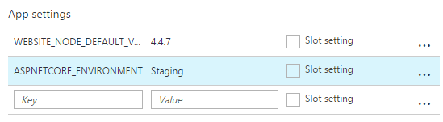
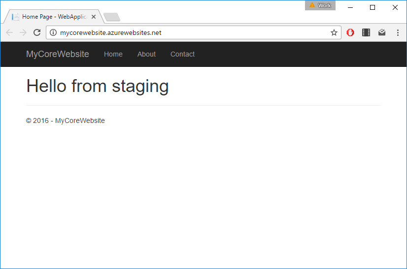
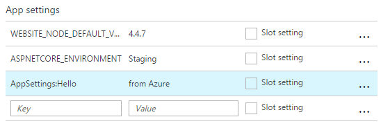
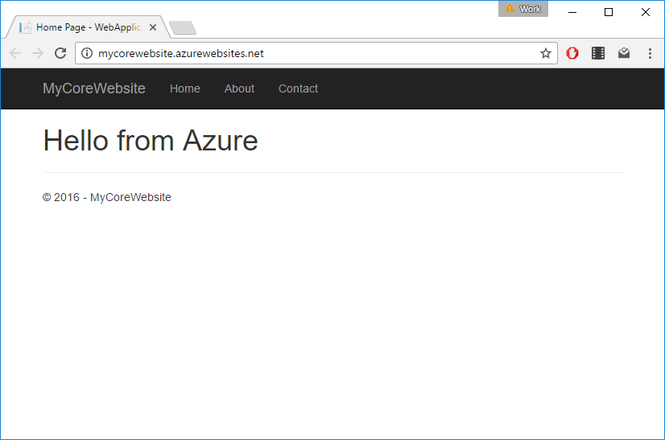

---
description: How to use config transformations when deploying an ASP.NET Core website to Microsoft Azure using either a JSON file or Azure application settings.
image: images/aspnetcore_appsetting.png
booksignup: true
---

# Configuration with Azure App Services and ASP.NET Core

##### [Thomas Ardal](http://elmah.io/about/), November 7, 2016

Most parts of elmah.io consist of small services. While they may not be [microservices](https://elmah.io/microservices/), they are in fact small and each do one thing. We recently started experimenting with ASP.NET Core (or just Core for short) for some internal services and are planning a number of blog posts about the experiences we have made while developing these services. This is the third part in the series about the configuration system available in Core. If you haven't already, read through [AppSettings in ASP.NET Core](appsettings-in-aspnetcore.md) and [Config transformations in ASP.NET Core](config-transformations-in-aspnetcore.md).

In the previous post, we saw how to switch configuration by specifying the `ASPNETCORE_ENVIRONMENT` environment variable. Let's try to deploy our website to Azure App Services. I've already created a new web app on Azure. To keep this post simple, I will deploy the website directly from Visual Studio, but in real life, you probably want to use Kudu, Octopus Deploy, Visual Studio Team Services or similar. Before deploying the website, we want to make sure that both `appsettings.json` and `appsettings.Production.json` are deployed. Add the production file in `Project.json` like this:

```json
{
  ...
  "publishOptions": {
    "include": [
      "wwwroot",
      "**/*.cshtml",
      "appsettings.json",
      "appsettings.Production.json",
      "web.config"
    ]
  },
  ...
  }
```

Now we're ready to deploy the website. Right click the project and set up a new publish method:



Click _Publish_ and inspect the website hosted on Microsoft Azure:



Surprised how Azure automatically knows about `appsettings.Production.json`? In fact it doesn't. Since we never told which environment we want to set in `ASPNETCORE_ENVIRONMENT` when running on IIS, Core defaults to the production environment.

You may have multiple environments running on Azure (like staging). There are two (probably more) ways to switch config values based on the current environment when running on Azure.

### Using `appsettings.json`

The first approach extends the usage of the `appsettings.json` file. If you'd want to create a separate set of config values for your staging environment, simply create a file named `appsettings.Staging.json` (remember to add that file to `Project.json` as well):

```json
{
  "AppSettings": {
    "Hello": "from staging"
  }
}
```

To tell Azure to use `appsettings.Staging.json`, add a new variable in the app settings section on your staging site:



Azure automatically adds all app settings as environment variables as well, why Core picks up the right config file:



### Using Application settings

The other approach to switch config values based on environment, involves App settings on Azure as well. As you may know, specifying an app setting on an Azure web app, with the same name as an app setting located in the `appSettings` element in `web.config`, will actually override that value. But what about Core, which don't have app settings in `web.config`? App settings in Core are actually overridable as well, by specifying the full path to the key:



By using the `:` character, it is possible to reference variable names inside complex structures in `appsettings.*.json` files. In this example, the value `from staging` (specified in `appsettings.Staging.json`) is overwritten with the value `from Azure`:



That's it for Core configuration. In the next posts, we will take a look at something that we think is even more exiting: [Logging in ASP.NET Core](/aspnetcore-logging-tutorial.md).