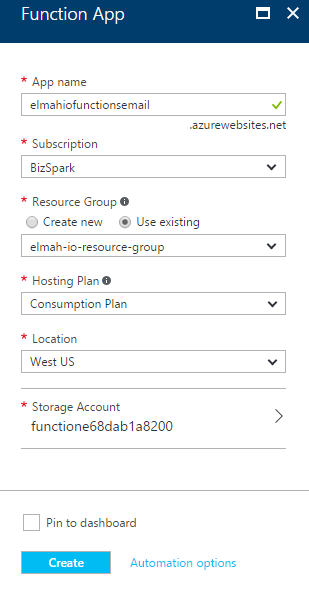
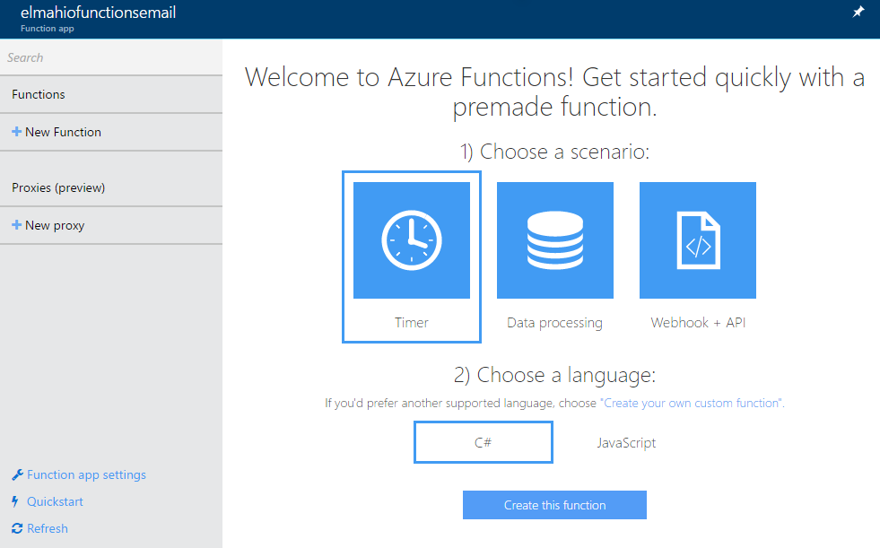

---
description: A guide to configuring and deploying Azure Functions with Kudu. The post also contains a list of problems that we experienced and how we fixed them.
image: images/function_app_created.png
booksignup: true
calltoaction: Monitor Azure Functions with elmah.io
---

# Configure and deploy Azure Functions with Kudu

##### [Thomas Ardal](http://elmah.io/about/), March 29, 2017

Time for another post in our series about Azure Functions. If you haven't already read the last two posts, they are here: [An introduction to Azure Functions and why we migrate](migrating-from-windows-services-to-azure-functions.md) and [Migrating a Topshelf consumer to a Function running on Azure ](migrating-a-topshelf-consumer-to-a-function-running-on-azure.md).

Now that we have a working Function, we are ready to deploy it to Azure. The easiest way to do this, is by using the deployment engine built into Kudu. Before we do that, we need to create a new Function App on Azure, by going to the Portal and selecting New | Function App:



Besides the usual pieces of info like name and resource group, you need to think about what to select in _Hosting Plan_. Azure Functions provide two options: _Consumption Plan_ and _App Service Plan_. _Consumption Plan_ means "Serverless", since you delegate the responsibility of finding a server to execute your Function to Azure. The server will be located in the location you select, but that's about all you know. If selecting _App Service Plan_, you can utilize a new or already created app service plan, running some of your existing Functions and/or websites. _Consumption Plan_ should be the default choice, unless you need to access some resources on your existing App Service Plan.

Once created, you'll see something like this:



The Portal lets you create Functions directly from the UI, but that's not what we are trying to achieve here. Click the _Function app settings_ link and click the _Configure continuous integration_ button. In the popup, you can set up deployment from GitHub, Bitbucket, local git repository or whatever source you prefer. The feature works exactly like when used from a Web App. When set up, changes are automatically deployed to the Function.

When the first deployment has successfully executed, hit the _Refresh_ link and the new Function shows up. When setting up deployments through Kudu, you cannot edit the Function directly on the Portal, since that would make it out of sync with the version under source control.

While setting this up, I ended up Googling multiple questions. To make it easier for you to get started, here's a compiled list of questions and answers.

### My Function isn't in the root directory, how to configure that?

I like the new structure in ASP.NET Core, with a solution in the root directory and a _src_ folder containing one or more projects. As default, Azure Functions looks for functions in the root only. To configure a sub folder, click the _Configure app settings_ button and add a new app setting named _Project_ with the relative path of the folder containing the `.funproj` file:



Be aware not to specify the full path to the project file, as you'd do when configuring an ASP.NET MVC (and friends) application.

### How do I override Function app settings?

All Functions in a Function App share a set of app settings, located in `appsettings.json`:

```json
{
  ...
  "Values": {
    "AzureWebJobsStorage": "DefaultEndpointsProtocol=...",
    "AzureWebJobsDashboard": "DefaultEndpointsProtocol=...",
    "Connection": "Endpoint=..."
  }
  ...
}
```

The `Values` object maps 1:1 to the values in the app settings section of the Function app settings. To override the `Connection` setting, simply input a new value in app settings:



### How do I access a virtual machine through point-to-site VPN from a Function?

You can secure communications between a web app and a virtual machine using Azure Point-To-Site VPN, as described in my article on MSDN: [Secure Communications Between Azure Web Apps and Virtual Machines](https://blogs.msdn.microsoft.com/mvpawardprogram/2016/03/01/secure-communications-between-azure-web-apps-and-virtual-machines/). If you need the same feature from your function, the only solution I've found so far, is to select _App Service Plan_ in _Hosting Plan_. Running the Function on the App Service Plan (rather than on the Consumption Plan), opens up for _Networking_ settings in the Function app settings view.

In the next post, I will set up logging and monitoring using elmah.io and the tools provided by Azure.