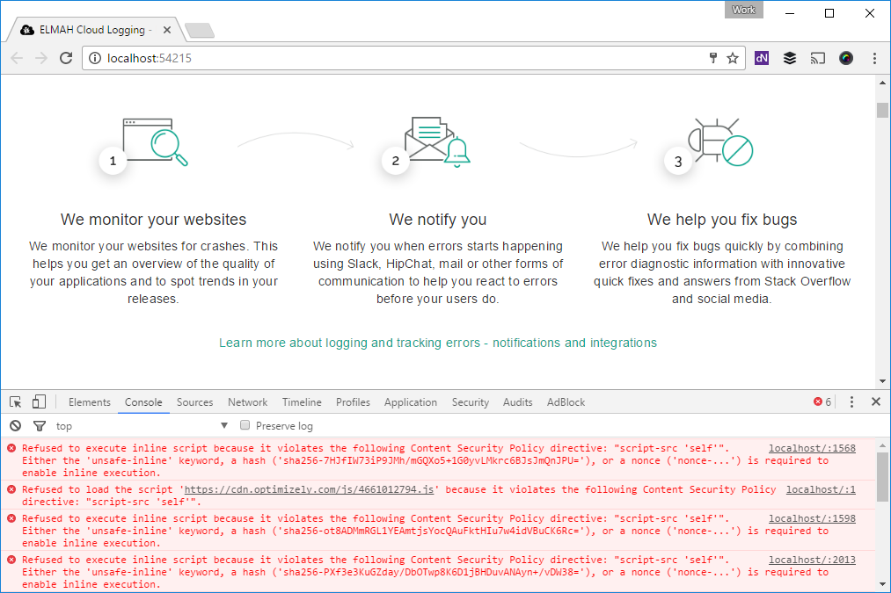

---
description: In this post, I'll explain the Content-Security-Policy header and how to set it up in an ASP.NET, MVC or Web API application.
image: images/content-security-policy-report.png
booksignup: true
---

# Content-Security-Policy in ASP.NET MVC

##### [Thomas Ardal](http://elmah.io/about/), March 6, 2017

In the previous post, [Improving security in ASP.NET MVC using custom headers](https://blog.elmah.io/improving-security-in-asp-net-mvc-using-custom-headers/), I skipped talking about the `Content-Security-Policy` header entirely. It is not harder to implement, but since it requires a bit more explanation to understand, the header now has its own post. As a small teaser, I will show you an easy way to implement the `Content-Security-Policy` header using elmah.io in the next post.

The `Content-Security-Policy` header, is a HTTP response header much like the ones from the previous post. The header helps to prevent code injection attacks like cross-site scripting and clickjacking, by telling the browser which dynamic resources that are allowed to load.

Let's start with a simple example:

```xml
<system.webServer>
  <httpProtocol>
    <customHeaders>
      <add name="Content-Security-Policy" value="default-src 'self'" />
    </customHeaders>
  </httpProtocol>
</system.webServer>
```

The `value` of the `Content-Security-Policy` header is made up of x segments separated by a semicolon. In the example above, we only specify a single segment, saying "only load resources from self". `self` translates to the same origin as the HTML resource. With this minimum configuration, your HTML are allowed to fetch JavaScripts, stylesheets etc. from the same domain that served the HTML referencing the resources. You won't be able to include external scripts from CDNs and similar.

Let's say that you host everything yourself, but want to include jQuery from cdnjs. You would need the following value to allow the browser to make requests outside your origin:

```xml
<add name="Content-Security-Policy" value="default-src 'self' https://cdnjs.cloudflare.com" />
```

Remember the segments I talked about? You can configure which domains to load different kind of resources from using a range of different `*-src` keys like this:

```xml
<add name="Content-Security-Policy" value="default-src 'self'; script-src 'self' https://cdnjs.cloudflare.com; style-src 'self' https://maxcdn.bootstrapcdn.com" />
```

This configuration let your web application load resources from its own domain plus scripts from `cdnjs.cloudflare.com` and stylesheets from `maxcdn.bootstrapcdn.com`. The combinations are endless, so check out the [documentation](https://developer.mozilla.org/en-US/docs/Web/HTTP/Headers/Content-Security-Policy) on Mozilla.org for details.

Chances are, you don't have a document where every dependency of your website is written down. Implementing the `Content-Security-Policy` header therefore takes time and digging. The best approach is to start limiting resources to `self` and testing the entire web application and see if it works or not. If running with developer tools open in Chrome or whatever browser may be your favorite, the Console will tell you when your web app tries to fetch or execute code not allowed in the header:



Another approach to catching all needed configuration, is to start by using an alternative header named `Content-Security-Policy-Report-Only`:

<add name="Content-Security-Policy-Report-Only" value="default-src 'self'" />

By adding this header instead of `Content-Security-Policy`, the browser will keep telling when something isn't allowed, but allow it anyway. This way you can keep an eye on the console, when running your website in production. When all error messages in the console are gone, you switch back to the original header.

Constantly keeping an eye the console and trying to touch all pieces of code in your application can be hard. In the following post, I will show you how to use elmah.io to monitor the output of the `Content-Security-Policy` header.