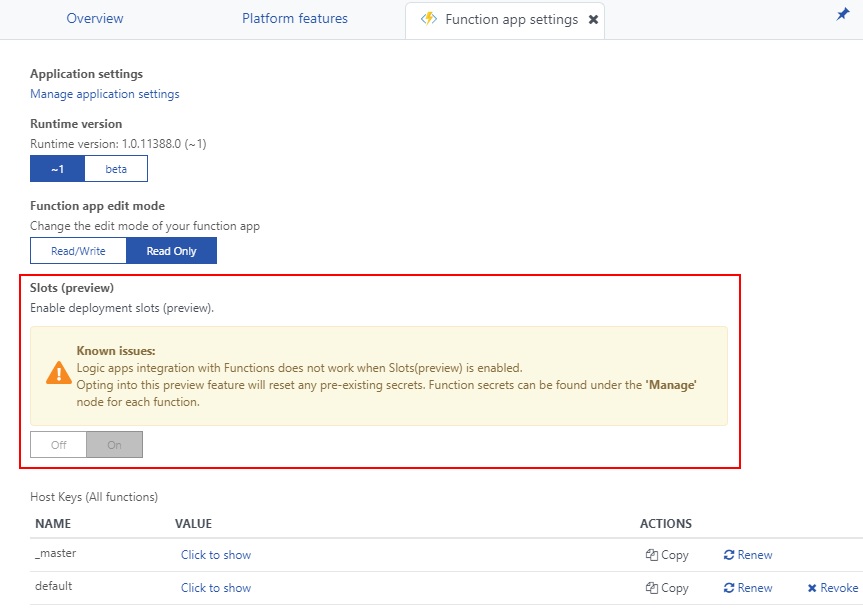
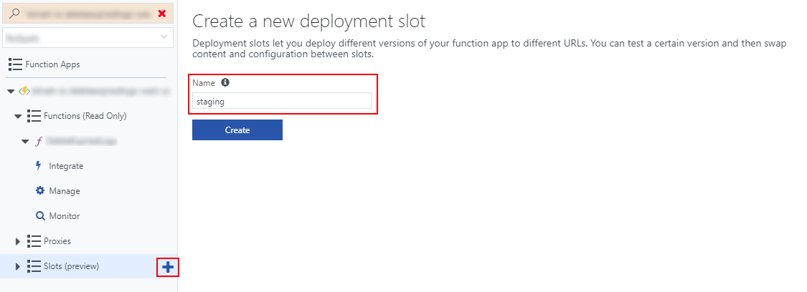
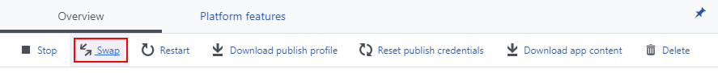
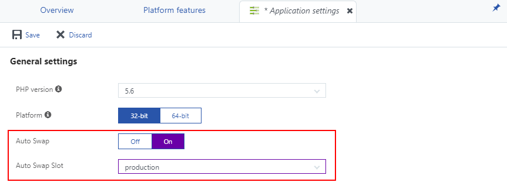
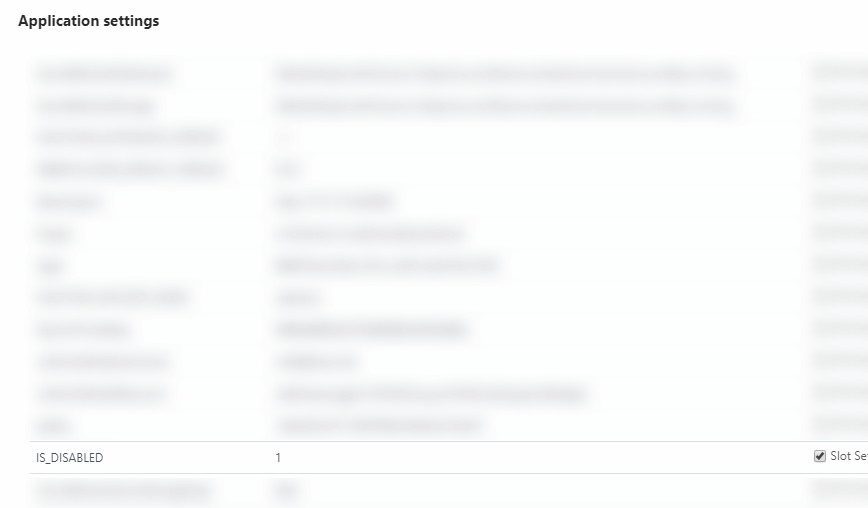

---
description: Tutorial for setting up Continuous Deployment of Azure Functions using deployment slots and auto swapping features on Microsoft Azure.
image: images/create_new_deployment_slot.png
booksignup: true
calltoaction: Monitor Azure Functions with elmah.io
---

# Continuous Deployment of Azure Functions with Slots

##### [Thomas Ardal](http://elmah.io/about/), December 7, 2017

Time for another post in our series about Azure Functions. This is the fifth post in the series about Azure Functions:

- Part 1: [An introduction to Azure Functions and why we migrate](https://blog.elmah.io/migrating-from-windows-services-to-azure-functions/)
- Part 2: [Migrating a Topshelf consumer to a Function running on Azure](https://blog.elmah.io/migrating-a-topshelf-consumer-to-a-function-running-on-azure/)
- Part 3: [Configure and deploy Azure Functions with Kudu](https://blog.elmah.io/configure-and-deploy-azure-functions-with-kudu/)
- Part 4: [Monitoring Azure Functions with the Portal and elmah.io](https://blog.elmah.io/monitoring-azure-functions-with-the-portal-and-elmah-io/)
- Part 5: Continuous Deployment of Azure Functions with Slots
- Extras: [Microsoft Azure Functions problems and troubleshooting](https://blog.elmah.io/microsoft-azure-functions-problems-and-troubleshooting/)

In part 3, I showed you how to set up deployment of Azure Functions from source control. In some scenarios, deploying into a running function or deploying all changes isn't the desired behavior. Luckily, Functions now support deployment slots like normal Azure Web Apps.

> Please notice that deployments slots are currently in preview and therefore not recommended for production. We have experienced a couple of problems with Function slots like functions stopping to consume messages from service bus and more.

To start utilizing deployment slots, you must enable it on the _Function app settings_ screen:



Once enabled, you can create a new slot by clicking the plus icon next to the _Slots_ tree node and inputting a name. For this example, I'll create a slot named _staging_:



Since we want every commit deployed on staging before swapping to production, you will need to disconnect source control deployment from the production slot (if already set up as shown in part 3). Like in part 3 of this series, set up deployment from source control (or whatever way you prefer to deploy) in your new staging slot. For details see [part 3](https://blog.elmah.io/configure-and-deploy-azure-functions-with-kudu/).

All changes should now be deployed to staging. When everything is working and tested, you can swap the staging and production slots by clicking the _Swap_ button:



Azure supports a feature called _Auto Swap_, which automatically swaps deployment slots when new changes are deployed to a slot. The end result will be similar to just setting up automatic deployments directly on your production slot, but there are benefits of putting a staging slot in the mix. We've noticed that timed functions running at the time of deployment, sometimes skip one or more iterations. While that could be considered a bug, it actually makes sense. When deploying a new build of your function, files need to be overwritten on disk, which creates a bit of downtime on your function app. Deployment slots are a great way to eliminate this downtime, since you deploy in the background and swap when the deployment is successful.

Auto Swap is available through the _Application settings_ view on the staging slot:



That's it! All changes are now deployed to staging and automatically swapped into production. But wait a minute! Doesn't two deployment slots (production and staging) means that your function app is deployed in two instances? It sure does. In scenarios where you have timed functions (and other types as well), you only want your functions running on production. Luckily, functions provide a mechanism for disabling functions by app settings. To set it up, add the `Disable` attribute on your function class:

```csharp
[Disable("IS_DISABLED")]
public static class MyFunctions
{
    ...
}
```

When looking at the generated `function.json`, the `disabled` field now looks like this:

```json
{
  ...
  "disabled": "IS_DISABLED",
  ...
}
```

`IS_DISABLED` should match an application setting on your function app. To set it up, add a new slot setting on both slots. In this case staging:



Notice the value `1` (true) as well as the check in _Slot Setting_. Similar, you will need the same setting on your production slot, but with the value `0`. Functions are now disabled on staging and enabled on production.

> There's a bug in the portal, showing both the production and staging functions as disabled. Apparently, portal doesn't know that the `disabled` field can be populated from app settings yet, and therefore marks it as disabled when not a boolean.