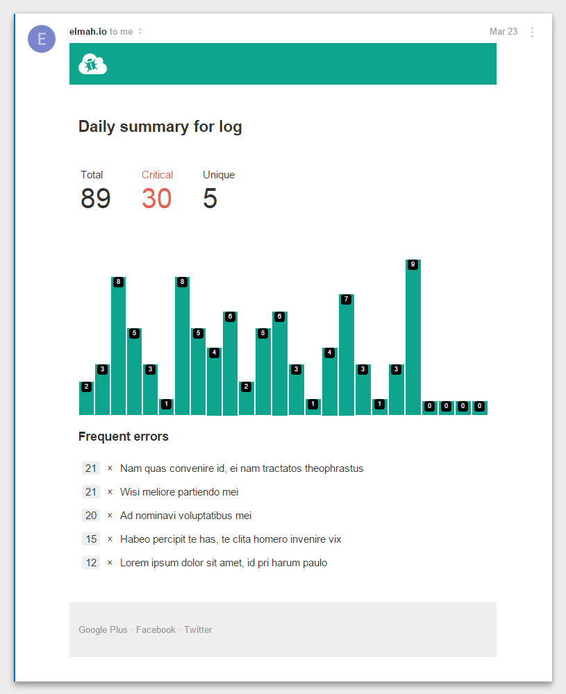
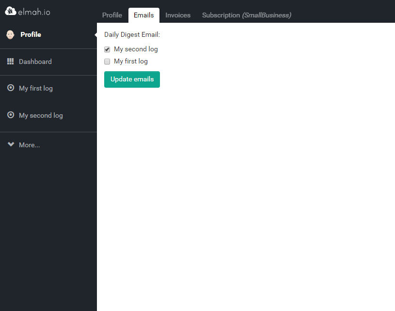

# Daily Digest Email

##### [Thomas Ardal](http://elmah.io/about/), April 22, 2015

Even though elmah.io provides a great UI for search your logs and even integrates with various notifiers through the business rules feature and the Zapier integration, you may not visit elmah.io every day. That’s why we’ve implemented the Daily Digest Email feature.

Sometimes you don’t want all the details, but just want to see how your application is doing on a daily basis. With the new Daily Digest feature, you can subscribe to a daily email, containing a great overview on what happened during the last 24 hours. The email contains enough details to fit the needs of the engineers and a great overview, to be used by managers, CTO’s etc. And remember, you can always dig into the details on the elmah.io website, if something looks suspicious.

Let’s take a look at the Daily Digest Email template:



In the top, you will find some key metrics like the total number of messages, the number of critical errors (error and fatal) as well as how many unique messages logged. Below the key metrics, you will find a graph showing the number of messages logged per hour. This is a great tool to get a quick overview of the past day and to spot trends. The bottom shows a list of the 5 most frequent messages.

To enable the Daily Digest Email, navigate to the Profile page and click the Emails tab:



We hope that you will love the new email feature as much as we’ve loved building it. And remember that we appreciate feedback and always listen to our users.

