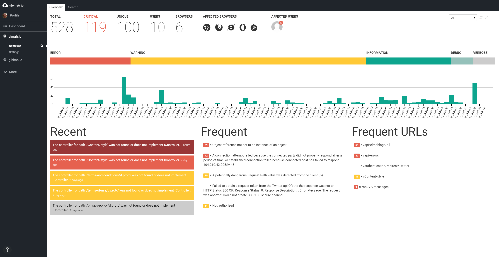

# Danish service provides maximum scaling and secures data on Azure

##### [Thomas Ardal](http://elmah.io/about/), September 17, 2015

This is an English translation of an [article](http://blogs.msdn.com/b/msdndk/archive/2015/09/09/dansk-tjeneste-skalerer-maksimalt-og-sikrer-data-paa-azure.aspx) that Microsoft wrote about us in their Danish MSDN Flash newsletter.

elmah.io helps developers find errors on their sites and services – and handles very large fluctuations in the incoming data volume. Therefore the service, located on Azure, can scale to the current demand and secure the clients data with extra storage in the cloud.



”The idea of elma.io is to provide a tool for developers, which collects website or service errors” Thomas Ardal, independent consultant and co-founder of elmah.io, explains.

The tool has been online for about one and a half years and has thousands of users, predominantly medium-sized businesses and individuals – it’s available on Microsoft Azure.

”In principle, we could have leased some virtual servers or used Amazon which I have also worked with but with Azure we get so many extras that would have been time consuming and insurmountable to build ourselves” Thomas Ardal elaborates.

For example, elmah.io utilizes the built-in Azure Service Bus to queue – or ‘park’ – data, uploaded by clients and then later process it asynchronously. This way, basically the clients can upload a whole bunch of data all at once without having to wait for it to be handled and made searchable.

”And sometimes we get a lot of data at once. Therefore we use auto scaling on Azure websites which automatically increases capacity when needed. That way one or more clients can send very large volumes of data without anyone else experiencing a decline in performance,” he explains.

Currently the service receives approximately 10,000 errors per hour, but there is a great variety in data volume. During peak periods that number can easily rise to 50,000 errors per hour, “but without noticeable difference in performance on our API,” Thomas Ardal adds.

At the back-end of the service, the third party software Elasticsearch plays a central role by making the large data volumes searchable. Elasticsearch is also on Azure and it is not unusual for the database to store over 100 GB. elmah.io utilizes Azure Blob storage concurrently for raw storage of incoming data.

”In normal operation Blob storage doesn’t play a major role. But in case of a system crash or an error on Elasticsearch, Blob functions as a storage reserve for all raw data that we can continue to work on. That way we actually have data stored in two places in the cloud, which ensures that nothing is lost,” Thomas Ardal says.

Thomas Ardal finds the stability of Azure excellent and the up-time to be very good. In time he has also learned to utilize some of the options available to keeping the service up, even when occasionally Azure doesn’t function optimally.

”There has been some Azure crashes over the past year and that’s always annoying. But you would experience the same thing whether having your servers hosted or maintaining them yourself. So all in all, we’re really pleased and have absolutely no plans to switch. Azure also contains some very valuable services and possibilities that play well together with .NET and it would be incredibly time consuming to develop this on our own. Blob storage and Azure Service Bus for example, but also an extensive protection against DDOS-attacks, which is good to have on hand” Thomas Ardal says.

He does add that you don’t feel tied hand and foot for that reason by the cloud service.

”We are at a point where we could move to another service, if we really wanted to. It’s difficult, yes, but certainly possible – and that is a good freedom to have. But it would require a virtually unthinkable change to the contractual relations, for example that Microsoft without due reason raised the price drastically or something like that. And that doesn’t seem to be in the cards,” he says.
