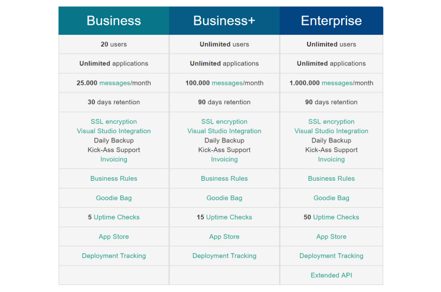

# Deployment Tracking and Uptime Monitoring included in plans

##### [Thomas Ardal](http://elmah.io/about/), August 3, 2017

I'm pleased to announce, that we are now able to offer both [Deployment Tracking](https://elmah.io/features/#deploymenttracking) and [Uptime Monitoring](https://elmah.io/features/#uptimemonitoring) to all of our users. Previously, Deployment Tracking were a paid add-on and we had similar plans for Uptime Monitoring. As of today, all users on the Business plan and up, will be able to use both features:



While Deployment Tracking is available on all three large plans, the number of included uptime checks vary from plan to plan. Yet another time, we are able to include additional features to all of you, our users, without changing the price.

A quick note about Uptime Monitoring. The feature is still in beta, but you no longer need to ask us for access to help testing. We are using Uptime Monitoring to monitor a lot of endpoints on elmah.io already (eat your own dogfood, right?) and the results are starting to look better and better.