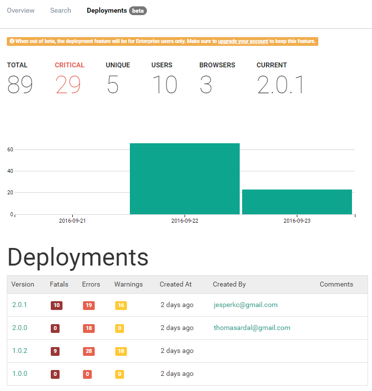

# Deployment Tracking

##### [Thomas Ardal](http://elmah.io/about/), September 23, 2016

We've been quiet the last couple of weeks and it's not because we needed to catch up on the last episodes of Mr. Robot. Quite the contrary actually. Today we are releasing the new Deployment Tracking feature on elmah.io. Deployment Tracking is a great addition to the elmah.io experience, making it possible for you to follow the quality of your releases.

> Deployment Tracking will be an Enterprise feature once out of beta. [Upgrade your account](https://elmah.io/profile/#subscription) to make sure to keep this feature.

Deployment Tracking is visible on each log as a new tab:



The first half of the screen show some statistics from the current release. If you feel like you've already seen this view, you are absolutely right. The statistics are pretty much a copy of the Overview tab, but showing errors from the current release only.

The bottom half show a list of the 10 recent releases. Each release is listed as a row in the table. The row shows the version number, how many errors and warning that are included in the release, who created the release and when and finally the release notes if any.

Like the Overview, pretty much everything on the Deployments tab are clickable, showing you all of the details from each metric.

So, what do you need to do in order to get the Deployment Tracking working with your software? Not much actually. First, you will need to add a version number to each message you send to elmah.io. Check out [Adding Version Information](http://docs.elmah.io/adding-version-information/) for details. Then you need to call the `deployments` endpoint in the [elmah.io API](https://api.elmah.io/swagger/). For instructions on how to do that, read through [Set Up Deployment Tracking](http://docs.elmah.io/setup-deployment-tracking/).

For now, calling the `deployments` API is a manual thing, but we are working to support common workflows like Visual Studio Team Services and Octopus Deploy.