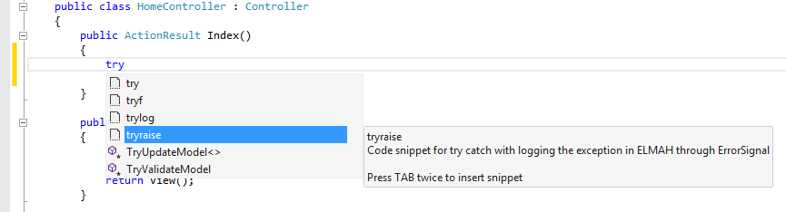
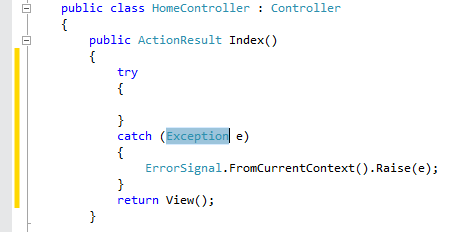
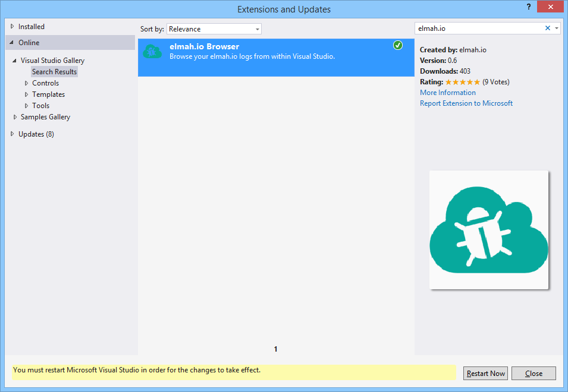

# ELMAH Code Snippets for Visual Studio

##### [Thomas Ardal](http://elmah.io/about/), November 21, 2014 in [Tutorials](/category/tutorials/)

Ever used [Code Snippets](http://msdn.microsoft.com/en-us/library/ms165392.aspx) in Visual Studio? Code Snippets is a great way to reduce keyboard input and help you be more productive by automating typing common lines of code.

At elmah.io we love ELMAH (big surprise). That’s why we have decided to open source the code snippets that we use internally to automate writing code against the ELMAH libraries. The snippets can be found at our organization on GitHub:

[https://github.com/elmahio/ELMAHCodeSnippets](https://github.com/elmahio/ELMAHCodeSnippets)

Let’s look at an example to see what the possibilities are using these snippets. Ever been frustrated doing manual logging to your ELMAH log using the ```ErrorSignal``` type? Not anymore with the ```tryraise``` snippet:



When hitting the Tab key, the following code is generated:



Pretty sweet, right? ```tryraise``` is one of 6 snippets available, but more will come. We also accept pull requests, so please send us your favorite ELMAH snippets or improve the ones already there.

To install the snippets, simply clone (or download) the [git repository](https://github.com/elmahio/ELMAHCodeSnippets) and import the snippets in the Code Snippet Manager from within Visual Studio.

But wait there’s more! You don’t even have to install the snippets manually. Our [elmah.io extension for Visual Studio](https://visualstudiogallery.msdn.microsoft.com/369827de-80ca-4b36-9b73-88bd85fdbc81) already ships with all of the snippets, making it super easy to install them using the Extensions and Updates feature:




