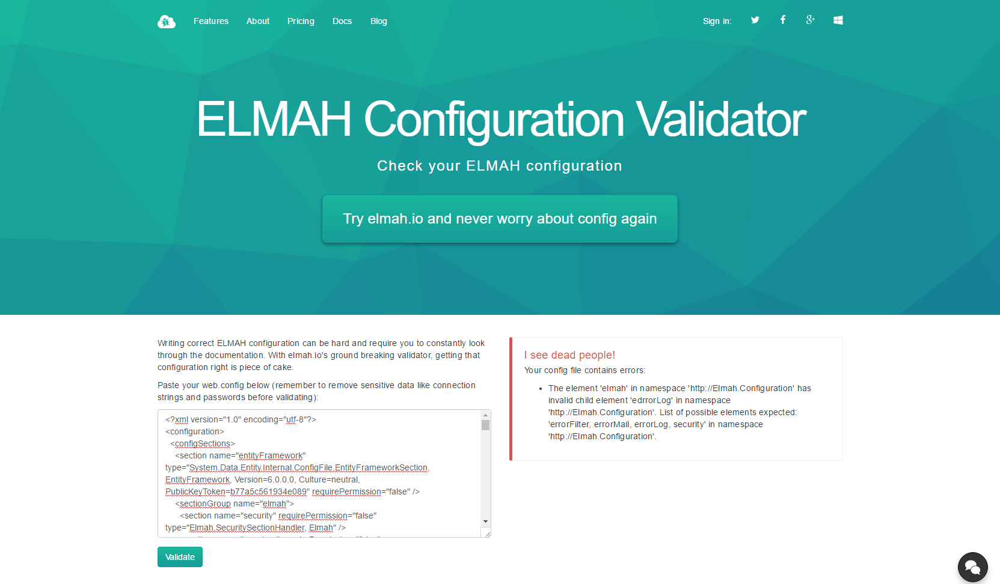

# ELMAH Configuration Validator

##### [Thomas Ardal](http://elmah.io/about/), March 15, 2016

> Disclamer: Configuring ELMAH (as well as elmah.io) happens through your application configuration file (like web.config). In the next version of ASP.NET, web.config files are removed, but web.config files will probably continue to exist for years to come.

Let's face it, configuring ASP.NET applications in XML is sort of pain in the a... There's a trend towards fluent configuration in C# code, which is way easier to write and understand. But for now, ELMAH (as well as elmah.io) is configured in your web/app.config.

To ease writing ELMAH configuration, we [created a GitHub repository](the-elmah-schema) a couple of days ago, with a XML schema for writing ELMAH config, originally created by Jeff Lingis. Today we take another step towards writing pain-free ELMAH config. Please welcome the [ELMAH Configuration Validator](https://elmah.io/tools/configvalidator).

The ELMAH Configuration Validator lets you validate your web.config file for errors in your ELMAH config. It's not a validator for web.config files per se, but rather a piece of code looking for `<elmah>` elements and validating them against the ELMAH Schema.



In the example above, I have a typo in the `<errorLog>` element, which the validator points out.

Like the ELMAH Security Validator, this new validator is free for anyone to use. Also make sure to check out the [ELMAH XML Schema](https://github.com/elmahio/Elmah-Schema) to add IntelliSense to your ELMAH configuration.
