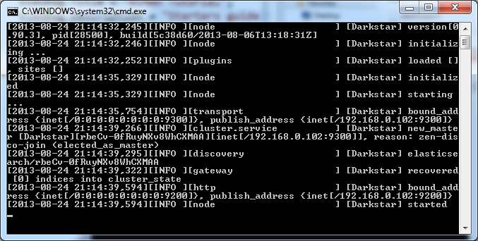

---
booksignup: true
calltoaction: Take ELMAH to the next level
---

# ELMAH Elasticsearch Tutorial

##### [Thomas Ardal](http://elmah.io/about/), September 4. 2013

> This article shows how Elasticsearch can be used as a logging backend for ELMAH. A basic knowledge about ELMAH is a prerequisite to reading this article. If you’re new to ELMAH, please read our [ELMAH Tutorial](https://blog.elmah.io/elmah-tutorial).

### Elasticsearch

So what’s [Elasticsearch](http://www.elasticsearch.org/) and why is it ideal for storing ELMAH errors? To answer the first question, Elasticsearch is a powerful search engine based on Lucene indexes. Why do we think it’s ideal to store ELMAH errors? Well because of three things in fact: Search, Search and Search! Nobody wants to log errors from their webserver, without being able to search them. Elasticsearch provides some really kick-ass search mechanisms, which simply isn’t possible in a SQL Database or requires a lot of knowledge about configuring individual products.

### Elmah.Io.Elasticsearch

At [elmah.io](http://elmah.io/) we love ELMAH and Elasticsearch so much, that we wrote our own implementation of a ELMAH error logger for Elasticsearch. The code is [open sourced](https://github.com/elmahio/Elmah.Io.Elasticsearch) at GitHub and we accept pull requests as well as feature requests like pretty much any other open source project. Elmah.Io.Elasticsearch is in fact a competitor to elmah.io itself, because you could build your own UI on top of our NuGet package. We believe that our product is strong enough for you to want to try it out anyway.

Elmah.Io.Elasticsearch is distributed through NuGet and works like any other error log implementation for ELMAH. Before we start looking at the ELMAH configuration, let’s install Elasticsearch.

### Installation

Before installing Elasticsearch, you need to install a Java JRE. We know it sounds like a world of pain, but Elasticsearch is based on Java and therefore require you to install it :( Just do us a favor and unclick the option which tries to cheat you into installing the Ask toolbar. Java is downloaded from the [download page](http://java.com/en/download/manual.jsp).

Now that we forever infected our machine (3 billion devices is infected with Java, right?), we are ready to install Elasticsearch. Head over to the [Elasticsearch download page](http://www.elasticsearch.org/download/) and download the Zip. When downloaded unpack the zip somewhere on your hard drive. Locate the bin folder and double click elasticsearch.bat. If everything have been setup correctly (you probably will experience some sort of obscure Java problem like JAVA_HOME not being specified), Elasticsearch should startup in a new command prompt:



Hooray! Elasticsearch is running.

### Configuring ELMAH

We know we promised some configuration. Before doing that you need to install the Elmah.Elasticsearch NuGet package (name differ to align with other storage packages for ELMAH):

```powershell
Install-Package Elmah.Elasticsearch
```

... and now for the XML. The downloaded NuGet packages already added a hell of a lot of XML to your web.config. In order for ELMAH to use the Elasticsearch error logger, located in the Elmah.Io.Elasticsearch assembly, locate the `<elmah>` element and make it look like so:

```xml
<elmah>
  <errorLog
    type="Elmah.Io.Elasticsearch.ElasticsearchErrorLog, Elmah.Io.Elasticsearch"
    connectionStringName="ElmahIoElasticsearch" />
</elmah>
```

Notice something missing? You’re right! The connection string to Elasticsearch specified in line 4. That little sucker is actually a name pointer to a standard connection string in the web.config:

```xml
<connectionStrings>
  <add name="ElmahIoElasticsearch" connectionString="http://localhost:9200"/>
</connectionStrings>
```

There you have it. ELMAH is now configured to use Elasticsearch using the Elmah.Io.Elasticsearch package. It doesn’t get much easier than that. You can use the default UI in ELMAH by accessing /elmah.axd in your browser. Doing that can be fine, but doesn’t really provide you with the strong search capabilities that we promissed you earlier. Elasticsearch comes with a UI called Head, which can help you do those funky searched. Unfortunatly you need to install Head yourself, but it’s a no brainer using this [installation guide](http://mobz.github.io/elasticsearch-head/).


