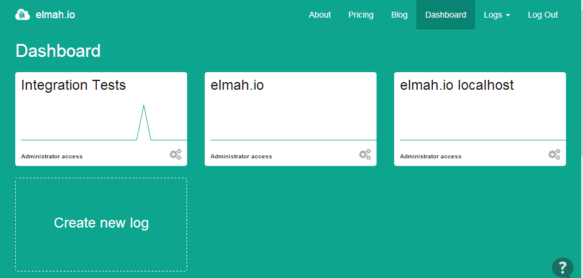
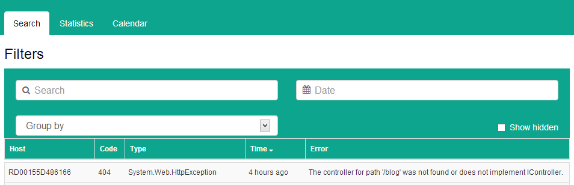
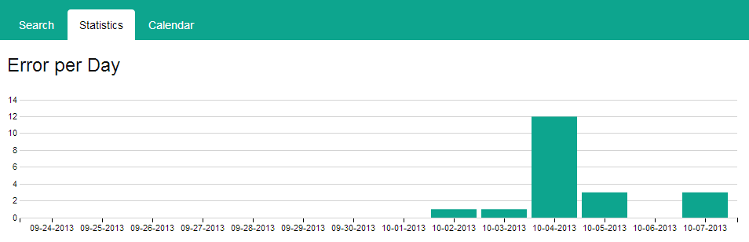
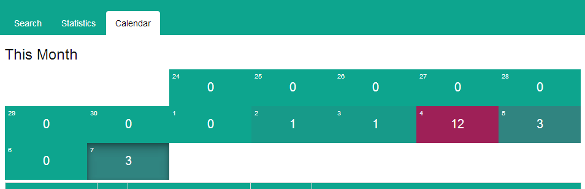
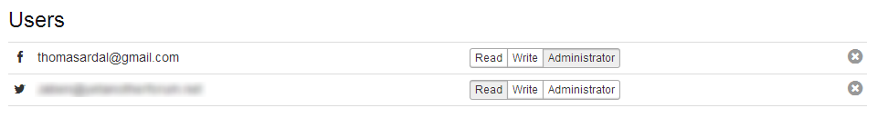

# elmah.io 20131015 released

##### [Thomas Ardal](http://elmah.io/about/), October 15, 2013

## Once again we have been busy building the best cloud based error logger for you guys and girls.

Here are the feature list:

### New dashboard
A lot of you have suggested improvements for the dashboard. We have listened and provided you with a new and hopefully much better and informative dashboard.



Each ELMAH log now shows a graph of new errors during the last 24 hours directly on the desktop. We really hope that you like it.

### Tabbed search
We have started splitting up different search entrances into separate tabs on the search page. There’s the search filters you already know from the previous version:



The new statistics tab, which btw will be extended with new chart types in the near future:



and finally a new shiny calendar view, showing you a calendar of the errors from the past 14 days:



### Change log access
Ever wanted to administrate log access on existing users? Now it’s possible through the new feature in the Users tab:



As usual please reach out if you have ideas for elmah.io either through [UserVoice](http://elmahio.uservoice.com/), [Twitter](https://twitter.com/elmah_io) or [Email](mailto:info@elmah.io).


