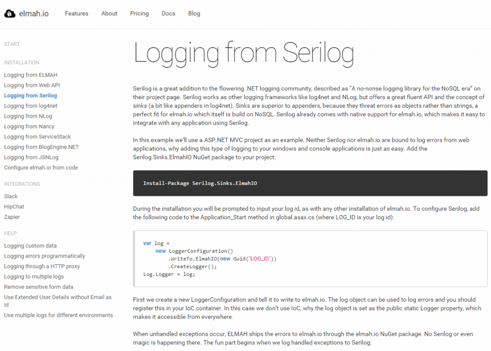

# elmah.io documentation

##### [Thomas Ardal](http://elmah.io/about/), September 14, 2015

Until now, the documentation for elmah.io have been centered around our blog. We initially chose to do this simply because it was easy to get started and because WordPress offered some nice tools to author new pages without us having to code everything. In time, the blog have grown with a lot of new pages and the clarity slowly disappeared. That’s why we’ve decided to do something new – drumrolls – say hello to the [elmah.io Documentation site](https://docs.elmah.io/).

The new documentation site (simply located on [docs.elmah.io](https://docs.elmah.io/)) contains updated documentation on how to install elmah.io and use the service. In this initial launch, we’ve transformed and improved multiple of our blog posts and made a well-structured documentation site. We tried out of a lot of different products for hosting the documentation site, from paid solutions to open source projects. We ended up using the awesome MkDocs which is based on Markdown and Python. We’ll probably write a blog post in the near feature to show you how we’ve made a beautiful looking documentation site using nothing else than Markdown files and a bit of custom styling.



The documentation is split into three parts: Installation, Integrations and Help. Installation contains various articles for settings up elmah.io in different web- and logging-frameworks. Integrations show you how to integrate elmah.io with other services like Slack and Zapier. Help contains the other stuff like tutorials on how to log custom data with ELMAH.

We hope that the new documentation site will help you utilize even more of elmah.io’s cool features and that having everything assembled on a single site will help clarify where to go for help.
