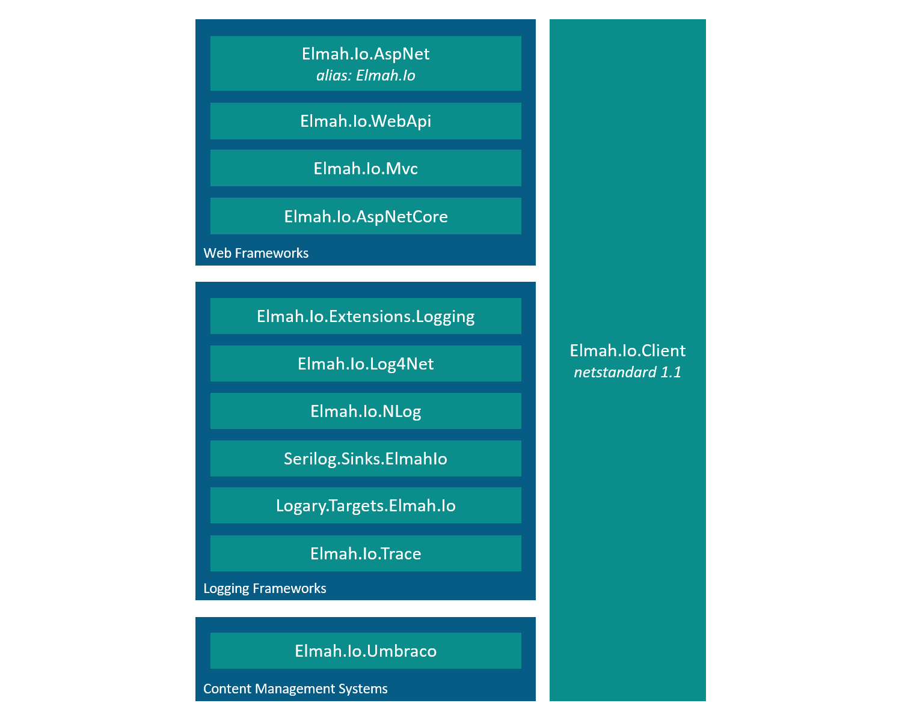

---
description: An updated overview of the client integrations available for elmah.io.
image: images/nuget_packages_revisited.png
---

# elmah.io NuGet packages revisited

##### [Thomas Ardal](http://elmah.io/about/), October 16, 2017

Back in January, we published the post [The elmah.io NuGet package landscape](https://blog.elmah.io/the-elmah-io-nuget-package-landscape/). Since then, most of our v3 client have matured into stable versions (more about the new versions and how to upgrade in a future post). When building the new v3 packages, we have used the jump in major version number to go back and fix some of the issues that we have seen on the v2 packages. This post is an overview of all integration packages available as of today.

Let's start by looking at a diagram:



If you remember the old diagram, you will see that package dependency have been heavily simplified. The idea with the new version of the packages is, that each package is as self contained as possible. Of course we don't want to include the source code for `Elmah.Io.Client` in all packages, but the time of shared packages named something with _core_ have passed.

### [Elmah.Io.Client](https://github.com/elmahio/Elmah.Io.Client)

Like previously, all packages depend on `Elmah.Io.Client` to call the elmah.io API. Since API keys are a required part of our new API, clients of `Elmah.Io.Client` needs to provide an API key as well. `Elmah.Io.Client` is built on netstandard 1.1, which means that it can be used from .NET 4.5/.NET Core 1.0 and forward.

### [Elmah.Io.AspNet and Elmah.Io](https://github.com/elmahio/elmah.io)

`Elmah.Io.AspNet` is our package for ASP.NET sites or any web framework built on top of ASP.NET (like MVC and Web API). For easy installation and backwards compatability, there's an alias package simply named `Elmah.Io`. While you can use both `Elmah.Io.AspNet` and `Elmah.Io` from MVC and Web API, we recommend to use the specialized packages, since they provide better solutions for each framework.

### [Elmah.Io.Mvc](https://www.nuget.org/packages/Elmah.Io.Mvc/)

Built on top of the same code base as `Elmah.Io.AspNet`/`Elmah.Io`, `Elmah.Io.Mvc` additionally depends on `Elmah.MVC`. `Elmah.MVC` is a great addition for ELMAH when running ASP.NET MVC. Easier configuration is among some of the benefits of using this package.

### [Elmah.Io.WebApi](https://www.nuget.org/packages/Elmah.Io.WebApi/)

Same story as `Elmah.Io.Mvc` just for ASP.NET Web API.

### [Elmah.Io.AspNetCore](https://github.com/elmahio/Elmah.Io.AspNetCore)

`Elmah.Io.AspNetCore` is out implementation for ASP.NET Core. Using middleware, all uncaught exceptions in your ASP.NET Core application, are send to elmah.io.

### [Elmah.Io.Extensions.Logging](https://github.com/elmahio/Elmah.Io.Extensions.Logging)

Integration for Microsoft.Extensions.Logging.

### [Elmah.Io.Log4Net](https://github.com/elmahio/elmah.io.log4net)

Integration for log4net.

### [Elmah.Io.NLog](https://github.com/elmahio/elmah.io.nlog)

Integration for NLog.

### [Serilog.Sinks.ElmahIo](https://github.com/serilog/serilog-sinks-elmahio)

Integration for Serilog.

### [Logary.Targets.Elmah.Io](https://github.com/elmahio/logary)

Integration for Logary

### [Elmah.Io.Trace](https://github.com/elmahio/Elmah.Io.Trace)

Integration for .NET Tracing

### [Elmah.Io.Umbraco](https://github.com/elmahio/elmah.io.umbraco)

Integration for Umbraco

### Where is `elmah.io.core`?

Some of you may remember the `elmah.io.core` package. In v2, this package contained our integration with ELMAH (the open source project) and all integrations depending on ELMAH included this package. In v3, `elmah.io.core` has been removed for several reasons:

1. When we originally named the package, .NET Core didn't exist. The term _core_ were meant as a "core part of elmah.io". But since we now have overlap between the two terms, we have decided to remove the package to avoid confusions.
2. The dependency graph had become too complext. 4 layers of package dependency simply caused more problems than it solved.