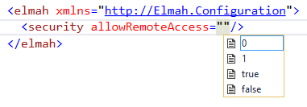

---
description: Tutorial on how to secure your ELMAH logs. Configure authorization through web.config and learn how to set it up when using ASP.NET MVC.
image: images/allowRemoteAccess.png
booksignup: true
calltoaction: Take ELMAH to the next level
---

# ELMAH security and allowRemoteAccess explained

##### [Thomas Ardal](http://elmah.io/about/), August 15, 2016

Securing your ELMAH log is a subject that have been touched upon in multiple presentations and blog posts. ELMAH itself even provide some great [documentation](https://elmah.github.io/a/securing-error-log-pages/), but questions on the subject still pop up on StackOverflow on a regular basis. I believe there's room for some extended documentation, giving you the full picture of the options available. This post is my attempt to demystify ELMAH security.

ELMAH comes with a couple of features for adding security to your logs out of the box. Basically they all focus around securing access to the URL `/elmah.axd` added automatically as part of the installation through NuGet.

## The `security` element

The `security` element located beneath the `elmah` element provides a single attribute named `allowRemoteAccess`:



As default, remote access to `/elmah.axd` isn't allowed meaning that requesting that URL on everything else than localhost, returns af HTTP status code 403. It is not recommended to open up for remote access to the ELMAH UI, but in some situations it may make sense. Setting `allowRemoteAccess` to `1` or `true`, makes `/elmah.axd` accessible on your public facing website.

## Access through ASP.NET authorization

So, if the default setting is not being able to access `/elmah.axd` how do you browse your error logs? Well in fact, combining remote access with ASP.NET authorization rules is your friend. When installing ELMAH, configuration for the `elmah.axd` URL where added to your web.config file:

```xml
<location path="elmah.axd" inheritInChildApplications="false">
  <system.web>
    <httpHandlers>
      <add verb="POST,GET,HEAD" path="elmah.axd" type="Elmah.ErrorLogPageFactory, Elmah" />
    </httpHandlers>
    <!-- 
      See http://code.google.com/p/elmah/wiki/SecuringErrorLogPages for 
      more information on using ASP.NET authorization securing ELMAH.

    <authorization>
      <allow roles="admin" />
      <deny users="*" />  
    </authorization>
    -->
  </system.web>
  <system.webServer>
    <handlers>
      <add name="ELMAH" verb="POST,GET,HEAD" path="elmah.axd" type="Elmah.ErrorLogPageFactory, Elmah" preCondition="integratedMode" />
    </handlers>
  </system.webServer>
</location>
```

As default, the `authorization` element is commented out. If you remove the comment around that element, you will get a default security setup where admin users will be allowed access to `/elmah.axd` only. This is configured through the `allow` and `deny` elements:

```xml
<authorization>
  <allow roles="admin" />
  <deny users="*" />  
</authorization>
```

If you want to allow a list of users only, there's an `users` attribute available on the `allow` element as well:

```xml
<authorization>
  <allow users="Thomas,Jesper" />
  <deny users="*" />  
</authorization>
```

[](https://elmah.io/?utm_source=blogbanner&utm_medium=blog&utm_campaign=blogbanner)

## What about ASP.NET MVC?

ELMAH were originally created for ASP.NET. Different features available in ASP.NET MVC have been causing a lot of head-scratching since introduced back in 2007. Some of you may have struggled with MVC's HandleErrorAttribute as well as getting custom errors and ELMAH working at the same time. In 2011, Alexander Beletsky created the [Elmah.MVC](https://github.com/alexbeletsky/elmah-mvc) package to help MVC developers using ELMAH. We highly recommend MVC projects to use this package, since it removes a lot of the frustrations that people are having with MVC and ELMAH.

To configure remote access to ELMAH using the Elmah.MVC, you will need to add a couple of application settings:

```xml
<appSettings>
    <add key="elmah.mvc.requiresAuthentication" value="true" />
    <add key="elmah.mvc.allowedRoles" value="Admin" />
    <add key="elmah.mvc.allowedUsers" value="Thomas" />
</appSettings>
```

The example above allows users with the role `Admin` as well as the user named `Thomas` to access the ELMAH UI (located on `/elmah` as default when using Elmah.MVC).

## Configure remote access using elmah.io

When using elmah.io, the problem with securing access to `/elmah.axd` goes away. Even though browsing your log through `elmah.axd` is fully supported when using elmah.io, we recommend you to access your logs through the elmah.io UI. This is secured behind a login of your choice. If you still want to control access to `elmah.axd` when using elmah.io, the solutions explained above is still fully supported.