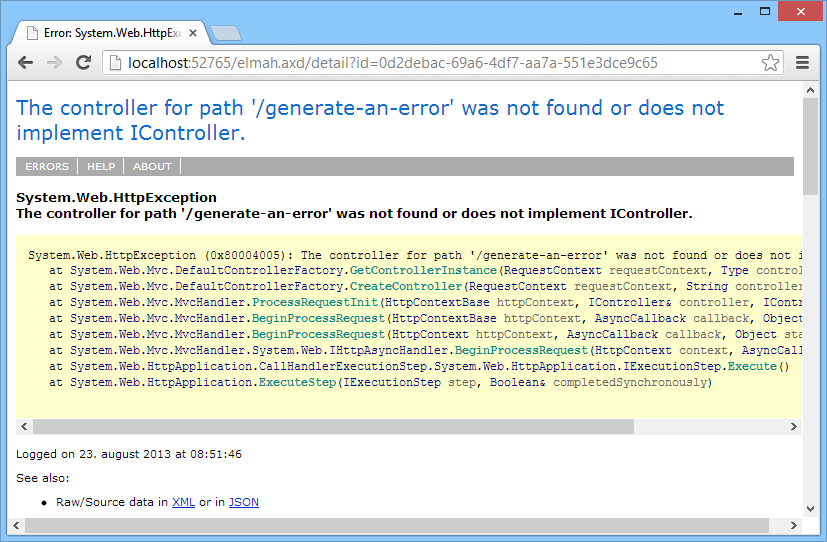

# ELMAH Tutorial

##### [Thomas Ardal](http://elmah.io/about/), August 29. 2013

There are a lot of articles trying to explain ELMAH out there, but most of them assume that you already know about ELMAH. This article is an attempt to explain how to get up and running with ELMAH in the simplest possible way.

So let’s start by talking about what ELMAH is. ELMAH is basically a NuGet package for .NET web applications, logging every exception occurring on one or more websites to some storage of your choosing. Unlike other logging frameworks ELMAH will, when configured in its most simple form, log every exception automatically. Sure, there’s an API you can use to log custom errors, but most people only use the automatic part. In this tutorial we will only focus on the basic parts.

## Installation
The easiest way of setting up ELMAH is through NuGet.

Run the following command:

```powershell
Install-Package ELMAH
```

... Or add ELMAH by right-clicking on References:



and search for ELMAH:



Click Install and ELMAH is installed in your project.

A lot of configuration has been setup in your web.config, but for now just start your web project. When started, navigate to: http://localhost:port/elmah.axd (replace port with your web applications port number). You should see a website looking like this:



## Logging errors

In the default configuration, ELMAH uses an in-memory logger which means that errors on the webserver are logged in-memory only. The in-memory logger is meant for development only and we will look at configuring a persistent logger later in this article.

For now generate a 404 by inputting an URL not found like: http://localhost:port/generate-an-error. Unless you configured custom error pages, the default error page is shown:



Behind the curtain, ELMAH silently hooked into the error event and logged the error.

## The error list

Try navigating to ELMAH again: http://localhost:port/elmah.axd:



The error just generated by accessing the illegal URL (/generate-an-error) now shows up on the list. ELMAH shows the most important variables in the table, but if you want the full picture, you can click the Details… link at the end of the error message. This will show ELMAH’s details view:



The details view shows you some detailed information about the thrown error. Often you would head straight for the stacktrace, but sometimes debugging is easier if you look at the server variables (cookies, http headers etc.). Scroll down for a view of all the server variables included in the failing HTTP request:



## Logging to SQL Server

Perfect! Our new error log works as it should. If you can live with errors being logged in-memory, you can finish the tutorial now. However, remember that errors are cleared if your website is recycled or similar. Most people configure one of the supported logger implementations to be able to keep the errors. The chances that you are running a SQL Server are probably larger than any other database, which is why we chose to show the SQL Server logger in this tutorial. Please visit the official ELMAH site for a description of the other loggers.

Setting up new loggers typically involve a bit of ELMAH configuration as well as some sort of connection string. Open your web.config file and locate the

element. The formatting may be a bit screwed up, but that is easily fixed by clicking Edit | Advanced | Format Document in Visual Studio. The markup looks like this:

```xml
<elmah>
  <!--
    See http://code.google.com/p/elmah/wiki/SecuringErrorLogPages for
    more information on remote access and securing ELMAH.
  -->
  <security allowRemoteAccess="false" />
</elmah>
```

Go ahead and delete the comment if you like. Notice that no logger configuration is present other than the security element. As mentioned before, ELMAH uses the in-memory logger when no logger has been specified. The allowRemoteAccess="false" attribute on the security elements tells ELMAH not to allow connections to errors other than from localhost. You typically don't want to allow for others to look through you error log, which is why we advise you to keep these security settings. More about this later.

To configure the SQL Server log, add a new error logger like this:

```xml
<elmah>
  <errorLog type="Elmah.SqlErrorLog, Elmah" connectionStringName="ErrorLog"/>
  <security allowRemoteAccess="false" />
</elmah>
```

In line 2 a new element has been added. Every error logger in ELMAH is configured using this element. You can only have one error logger per project. The type attribute tells ELMAH what error logger to use. In this case we use the SqlErrorLog class from the Elmah assembly, which we already added through NuGet. Other error loggers may require you to add additional packages. The SqlErrorLog logger requires another attribute named connectionStringName. Again, different error loggers require different configuration to run. The connectionStringName should point to a SQL connection string name ErrorLog:

```xml
<connectionStrings>
  <add
    name="ErrorLog"
    connectionString="Data Source=localhost;Initial Catalog=ELMAH;Integrated Security=SSPI;"
    providerName="System.Data.SqlClient" />
</connectionStrings>
```

In this example we chose to configure ELMAH to use its own database named ELMAH located on a SQL Server instance on localhost. We recommend using a separate database for ELMAH, but you can use your existing database if you like.

ELMAH requires some tables and stored procedures to be created on the configured database. The scripts for ELMAH 1.2 can be found here: [ELMAH v1.2 MS Sql Server DB script](https://code.google.com/p/elmah/downloads/detail?name=ELMAH-1.2-db-SQLServer.sql).

## Manually logging errors

Often you want to catch errors before returning an error response to the client. Since ELMAH only logs uncaught exceptions, you need some way of logging errors to ELMAH manually. With ELMAH’s `ErrorSignal` class we can do exactly that:

```csharp
try
{
    int i = 0;
    int result = 42 / i;
}
catch (DivideByZeroException e)
{
    ErrorSignal.FromCurrentContext().Raise(e);
}
```

In the example above, we use the `FromCurrentContext` helper to create a new instance of `ErrorSignal`. ELMAH also works outside the context of a webserver and in this case, you would simply use the default logger with null as the HTTP context:

```csharp
ErrorLog.GetDefault(null).Log(new Error(e));
```

## Securing the error log

When installed through NuGet, ELMAH automatically sets the `allowRemoteAccess` attribute to `false`. This means that you're only allowed to access `elmah.axd` when running on localhost. Like mentioned previously, it's not recommended to set this to `true`.

To secure access to elmah.axd, ELMAH supports authorization through the authorization feature in ASP.NET. To allow only a single role to access `elmah.axd`, locate the configuration section for `elmah.axd`and deny all users except users with the admin role (role name may vary from your setup):

```xml
<location path="elmah.axd">
    <system.web>
        <httpHandlers>
            <add verb="POST,GET,HEAD"
                 path="elmah.axd"
                 type="Elmah.ErrorLogPageFactory, Elmah" />
        </httpHandlers>
        <authorization>
            <allow roles="admin" />
            <deny users="*" />
        </authorization>
    </system.web>
    <system.webServer>
        <handlers>
            <add name="ELMAH"
                 verb="POST,GET,HEAD"
                 path="elmah.axd"
                 type="Elmah.ErrorLogPageFactory, Elmah"
                 preCondition="integratedMode" />
        </handlers>
    </system.webServer>
</location>
```



