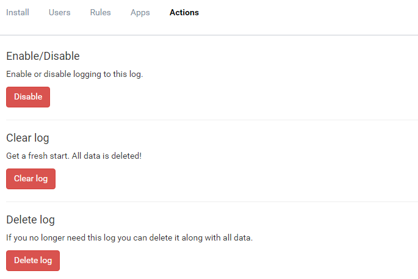

# Disable Logging

##### [Thomas Ardal](http://elmah.io/about/), October 5, 2016

A question that we often get is "how do I temporarily disable logging?". Until now, our answer has been to comment out the `errorLog` element in web.config or similar for our range of integrations. Making local code changes (maybe directly in production? Uf!) isn't really a great way to disable logging. That's why we now have a disable button on log settings:



Click the _Disable_ button and we stop logging your messages until you click the button again. Nothing needs to be changed on your end, since ignoring the errors happen in our backend.