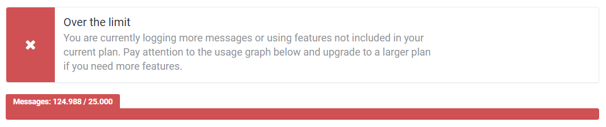

# Enforcing message limits

##### [Thomas Ardal](http://elmah.io/about/), October 12, 2017

Today, I want to share some future plans with you. We have been planning changes to the message limit on elmah.io for some months now. elmah.io always had a maximum number of messages available on each plan (like 5,000 messages per month on Small Business, 100,000 on Business+ etc.).

I'll save the bad news a bit and start out with some improvements. We are planning to increase the number of messages included in each plan. We realize that even for startups, 1,000 messages per month simply isn't enough. I cannot share the final limits with you, since we haven't settled yet. But I promise you that you will receive a nice improvement without having to pay a cent more.



For now, the message limits on elmah.io are actually soft limits. While we would love to keep it this way, it's becoming clear that this isn't scalable. My initial thought with the soft limits were, that users would notice going over the limit each month and upgrade to a larger plan. Unfortunately, this haven't always been the case and we have seen logs containing up to 300 times the included number of messages month after month.



During the last 6 months we have been collecting metrics around limits. In average 25% of our users log more than included in their plan. Almost 10% even log more messages than included in the plan higher than the one already selected. I hope that you see the problem.

In a month or two, we will start enforcing message limits by capping logging when a subscription goes over its limits. To help you monitor your current usage, we send an email to all of the administrators on your organization, when you are getting near the limit. Likewise, an email is sent when going over. The current consumption is visible at all times, by visiting the [extended usage graph](https://blog.elmah.io/extending-the-usage-graph/). Unlike most of the other solutions out there, we still allow you to delete one or more messages to free up space. Clearing an entire log will also allow you to log new messages. We think that this is a fair solution for everyone, rather than keeping your data hostage.