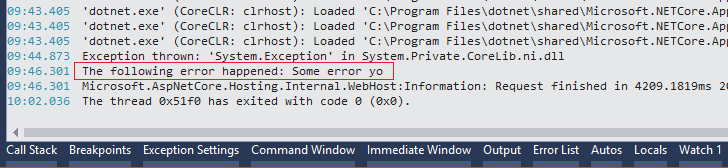

# Error Logging Middleware in ASP.NET Core

##### [Thomas Ardal](http://elmah.io/about/), December 5, 2016

This is part 5 in our series about ASP.NET Core:

- Part 1: [AppSettings in ASP.NET Core](https://blog.elmah.io/appsettings-in-aspnetcore/)
- Part 2: [Config transformations in ASP.NET Core](https://blog.elmah.io/config-transformations-in-aspnetcore/)
- Part 3: [Configuration with Azure App Services and ASP.NET Core](https://blog.elmah.io/configuration-with-azure-app-services-and-aspnetcore/)
- Part 4: [ASP.NET Core Logging Tutorial](https://blog.elmah.io/aspnetcore-logging-tutorial/)
- Part 5: Error Logging Middleware in ASP.NET Core
- Part 6: [ASP.NET Core Routing Tutorial](https://blog.elmah.io/aspnetcore-routing-tutorial/)
 
Most parts of elmah.io consist of small services. While they may not be [microservices](https://elmah.io/microservices/), they are in fact small and each do one thing. We recently started experimenting with ASP.NET Core (or just Core for short) for some internal services and are planning a number of blog posts about the experiences we have made while developing these services. This is the fifth part in the series.

This post is about the concept of middleware in Core. We have named the post *Error Logging Middleware in ASP.NET Core*, because we want to use error logging as an example of utilizing middleware. The concepts around middleware shown in the examples throughout this post isn't bound to error logging in any way and can be used as a foundation for building all types of middleware.

Middleware are code components executed as part of the request pipeline in Core. If you have a background in ASP.NET and think this sounds familiar, you're right. Middleware is pretty much HTTP modules as you know it from ASP.NET. The biggest difference between modules and middleware is really how you configure it. Modules are configured in `web.config` and since Core doesn't use the concept of a `web.config`, you configure middleware in C#. If you know Express for Node.js, you will find that configuring middleware heavily borrow a lot of concepts from that.

Let's wait with more babbling about middleware and look at an example. Middleware in its most simple form, is a C# class. Let's create some error logging middleware:

```csharp
public class ErrorLoggingMiddleware
{
    private readonly RequestDelegate _next;

    public ErrorLoggingMiddleware(RequestDelegate next)
    {
        _next = next;
    }

    public async Task Invoke(HttpContext context)
    {
        try
        {
            await _next(context);
        }
        catch (Exception e)
        {
            System.Diagnostics.Debug.WriteLine($"The following error happened: {e.Message}");
        }
    }
}
```

In order for our middleware to work, we need to implement two things. A constructor accepting a `RequestDelegate` and an `Invoke` method. The contructor is called a single time, but the underlying delegate will change from request to request. All middleware components are responsible for either executing the next link in the pipeline (`_next`) or terminate the pipeline by not calling `_next`. In our case, we want to execute the rest of the pipeline in order to catch any exceptions happening while processing the HTTP request. When an exception is catched, we log a message to `System.Diagnostics.Debug`. In real life you probably want to log somewhere better, but for the demo, we want the exception to show up inside Visual Studio only.

[](https://elmah.io/?utm_source=blogbanner&utm_medium=blog&utm_campaign=blogbanner)

To tell Core about our new and shiny piece of middleware, configure it in `Startup.cs`:

```csharp
public void Configure(IApplicationBuilder app, IHostingEnvironment env, ILoggerFactory fac)
{
    ...
    app.UseMiddleware<ErrorLoggingMiddleware>();
    ...
}
```

To test the middleware, make the `Index`-method in `HomeController` throw an exception:

```csharp
public class HomeController : Controller
{
    public IActionResult Index()
    {
        throw new Exception("Some error yo");
    }
}
```

When starting the project, the exception is now logged to the Output window in Visual Studio:



Success! We just implemented our first piece of functional middleware for Core.

While calling the `UseMiddleware<>` method in `Startup.cs` definitely work, it is considered good practice to create a custom `Use`-method:

```csharp
public static class ErrorLoggingMiddlewareExtensions
{
    public static IApplicationBuilder UseErrorLogging(this IApplicationBuilder builder)
    {
        return builder.UseMiddleware<ErrorLoggingMiddleware>();
    }
}
```

Call the static method in `Startup.cs`:

```csharp
public void Configure(IApplicationBuilder app, IHostingEnvironment env, ILoggerFactory fac)
{
    ...
    app.UseErrorLogging();
    ...
}
```

For an example on how to implement fully featured error logging middleware for Core, check out our [elmah.io support for ASP.NET Core](https://docs.elmah.io/logging-to-elmah-io-from-aspnet-core/) on [GitHub](https://github.com/elmahio/Elmah.Io.AspNetCore/blob/master/Elmah.Io.AspNetCore/ElmahIoMiddleware.cs).

In the next post, we will take a look at [routing in ASP.NET Core](/aspnetcore-routing-tutorial.md).