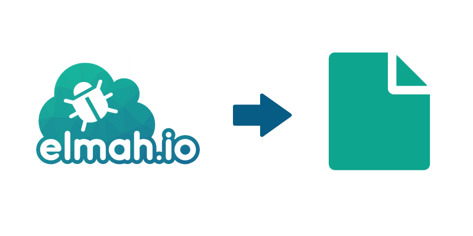

---
image: images/export-from-elmah-io-to-file.png
---

# Exporting data from elmah.io

##### [Thomas Ardal](http://elmah.io/about/), January ?, 2018

A common request through the elmah.io support is: how do I export my data?

The reasons for exporting data may be:

- Import into Excel or similar for custom processing and graphing.
- Backup of old data.
- Switch to another error management system.



Let's make one thing clear. The log messages you ship to elmah.io are yours. That's why we want to make it as simple as possible to pull our data from elmah.io. We looked at creating a UI for the purpose, but exporting something like a GB of data from a website never works very well.

Let me introduce you to [Elmah.Io.Export](https://github.com/elmahio/Elmah.Io.Exporter). Elmah.Io.Export is a small CLI (command-line interface) for exporting data from elmah.io. It's implemented in .NET Core and therefore works on all supported operating systems.

For now, the tool is available on GitHub, where you can clone and build it:

```powershell
git clone https://github.com/elmahio/Elmah.Io.Exporter.git
```

When built, go to the output directory and run:

```powershell
dotnet Elmah.Io.Export.dll -ApiKey API_KEY -LogId LOG_ID
```

Remember to replace `API_KEY` with your API key ([where is my API key?](https://docs.elmah.io/where-is-my-api-key/)) and `LOG_ID` with your log ID ([where is my log ID?](https://docs.elmah.io/where-is-my-log-id/)). Elmah.Io.Export now saves all content from the chosen log to a file. The tool supports a range of options like a query and date range.

Looking to import some test data in one or more logs? [Elmah.Io.DataLoader](https://github.com/elmahio/Elmah.Io.DataLoader) to the rescue!