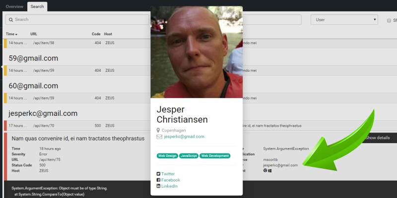

# Extended User Details

##### [Thomas Ardal](http://elmah.io/about/), Match 16, 2015 in [Tutorials](/category/tutorials/)

With elmah.io’s new Extended User Details feature, you can lookup extended information about the user experiencing a bug on your website.

We all sometimes forget the fact that any website error hits a user one way or another. It may be a simple bug with a missing icon somewhere, but in other cases you potentially loose a sale caused by an error in your checkout flow. Everyone want’s to know their users better these days, right? With the new Extended User Details feature, you can dig into the details off the actual user experiencing a bug on your website. Take action and let your users know, that they are not left stranded. Write an email, Check out their home town, browse through their social profiles like Twitter and Facebook. The possibilities are endless.

Extended User Details are available from all of the spots showing user info. From the Overview tab on each log, click an avatar in the Affected Users widget:



In the log search, click the user on the error details:



Extended User Details are available on the error overlay and the error details page as well.
