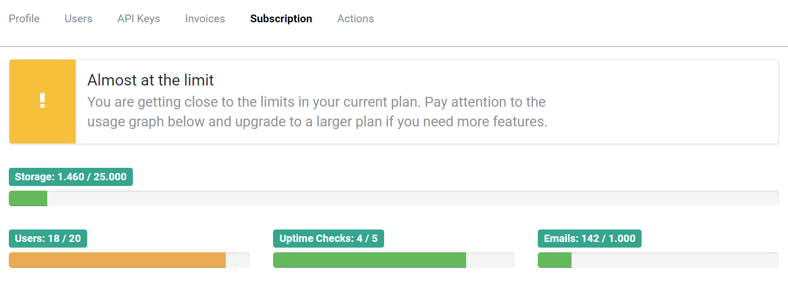

# Extending the usage graph

##### [Thomas Ardal](http://elmah.io/about/), September 25, 2017

Since we launched [Usage Monitoring](https://blog.elmah.io/usage-monitoring/) last year, we almost get no questions about how much space you guys use on your subscription. The difference between plans on elmah.io are primarily based on the included storage. Some features vary from plan to plan as well, like the allowed number of users in your organization and the maximum number of uptime checks. With the recent change to the usage graph, getting an overview of your current elmah.io utilization is as transparent as ever:



Each progress bar show the current number of message, users etc. and an upper limit. In the example, the organization currently include 18 users with a maximum of 20 (Business plan). This shows a warning about the organization getting near the upper limit.

The email counter to the far right is currently a counter only, but limitation will be implemented at a later stage. Sending emails today is more than just setting up a local SMTP server. I actually ran my own SMTP server during my young years and experienced the pains of keeping a service like that alive and making sure that emails are successfully delivered. For those reasons, we have partnered with a cloud-based company for sending out emails. An awesome but in no way free solution. Limiting the number of emails is the only way we can keep our prices at the same level as when we introduced elmah.io years ago. The included number of emails on each plan, have been calculated by looking at actual statistics from the last 3 months of operation.

The extended usage graph is available on the Subscription tab of your organization settings page. To open settings, click the  icon next to your organization in either the left menu or on the dashboard.