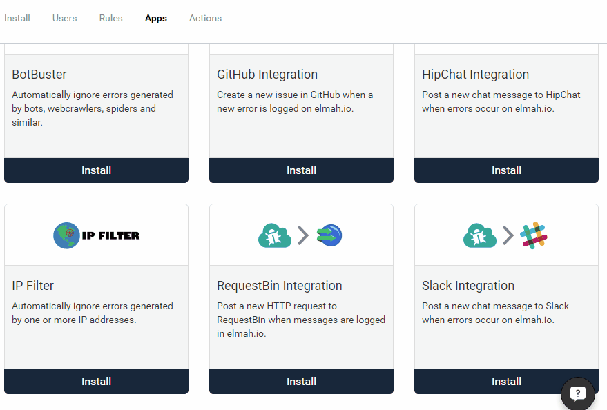

# Filtering Errors by IP Addresses

##### [Thomas Ardal](http://elmah.io/about/), August 8, 2016

Ever wanted to ignore errors from your own IP, a range of known addresses from crawlers or what about localhost? With elmah.io's business rule feature, this has been possible from the day it was [born](http://blog.elmah.io/elmah-io-20131227-released/). Until today, setting up IP filtering has been a somehow manual thing that would require you to know about the internals of elmah.io. That's why we've ported this to an app in the elmah.io [App Store](https://elmah.io/features/appstore).

To ignore one or more IP addresses, add the new IP Filter app to your log(s):



In the demo, a range of addresses are ignored. If you want to ignore a single IP only, add that IP in both the *From* and *To* fields.