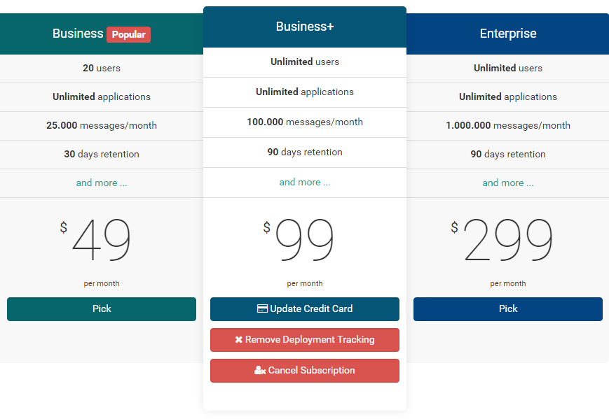
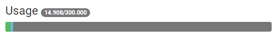
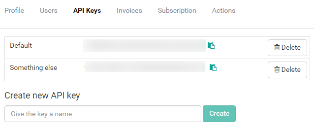

---
description: Five advantages by moving the subscription from the user to the organization. Every administrator can now manage credit cards, monitor usage and more.
image: images/pick_plan.png
---

# 5 advantages by moving your subscription

##### [Thomas Ardal](http://elmah.io/about/), January 19, 2016

If you are an elmah.io administrator in your company, we just unlocked a range of new features for you. In short, we moved your subscription from user to organization. To understand the rationale behind this, let's begin with a bit of history.

When we initially introduced elmah.io, our customers where primarily single users, monitoring one or more logs. As a user, you would buy a subscription to use elmah.io after the trial expired. That approach actually worked for a year or two, but as our user base grew, so did the size of the companies choosing elmah.io. Being limited by the fact that only the paying user were able to create new logs, made it difficult to use elmah.io as a company with multiple employees.

To help fix this problem, we [introduced organizations](/organization-support/) last year. With organization support, managing logs and users, became much easier. Suddenly, every administrator in the organization, were able to create logs, manage users and more. To save time, we decided to keep the subscription on the user creating the organization.

A half year passed and new challenges started to occur, when needing to administrate the subscription. Even with organization support, only the paying user where able to administrate credit cards and more. Today, we are ready to change that. All of the subscriptions previously located on users, have now been moved to organizations where they belong. This means that all administrators on the organization, will have administrative rights on not only logs and organization, but also the subscription. Here are five features now available for everyone:

### Upgrade or downgrade your subscription

The new Subscription tab on your organization settings, makes it easy to upgrade, downgrade or cancel your subscription. Simply *Pick* another plan:



### Administrate credit cards

The Subscription tab also makes it possible to update your credit card. Need to switch cards or is your credit card about to expire? No problem, simply input a new credit card.

### Usage monitoring

A lot of you asked for a usage graph to keep track of your current usage on elmah.io. While we introduced [usage monitoring](http://blog.elmah.io/usage-monitoring/) last year, only the paying user where able to see it. Like the remaining features, everyone with administrative access to your organization, can now monitor how much space you are currently using:



### Printing invoices

Invoices are important in order to keep your accountant happy. Like the remaining tabs related to subscriptions, the Invoices tab is now available on the organization settings as well. This means that multiple users will be able to pull invoices. You can even add your accountant, but bear in mind, that he/she will have access to administrate your entire organization. As part of moving invoices, we have fixed all of the feature requests we've received on invoices as well.

### Multiple API keys

As part of our data migration for moving subscriptions from users to organizations we realized, that we needed to support multiple API keys as well. There's a new API Keys tab beneath your organization settings, making it possible for your to generate keys for different purposes, delete keys if they are compromised etc.:



As a note, you may not use API keys yet. API keys are part of our next generation clients for elmah.io. Some of the prereleases out there (like our [support for ASP.NET Core](http://docs.elmah.io/logging-to-elmah-io-from-aspnet-core/)), already utilize API keys. We'll move everything to API keys and our [V3 API](https://api.elmah.io/swagger/ui/index) in the near future.

We hope that you will like the new possibilities with your subscription. It has been a tough task to solve, but as usual, without any downtime for our users.