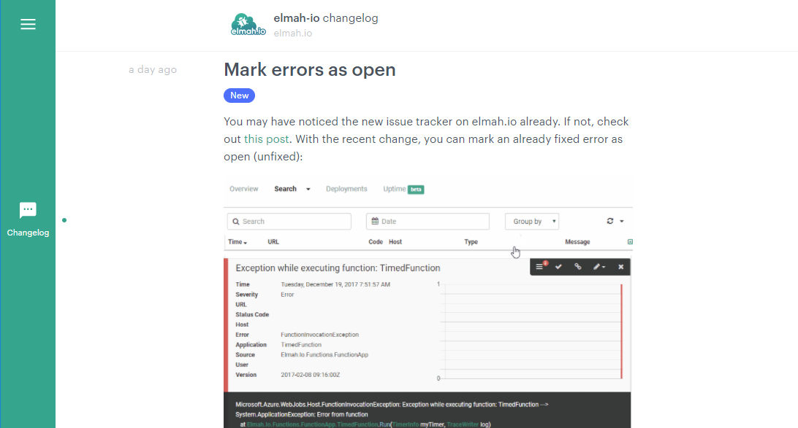

# Follow all changes on elmah.io

####[Thomas Ardal](http://elmah.io/about/), December 20, 2017

If you are a recurring reader of this blog, you know that we announce major new features here once in a while. Major new features are not the only priority of the elmah.io development team. We constantly make adjustments, fix bugs, create minor features not worth mentioning on the blog, etc.

If you just want to hear about new major features that's fine. Keep following this blog and scroll through the monthly update available behind your login on elmah.io. But! If you want more details of all the changes we implement, you are hereby welcomed to our new changelog, hosted on Headway: [elmah.io Changelog](https://headwayapp.co/elmah-io-changelog):

We are currently working to bring this changelog inside the elmah.io UI. For now, visit the URL above and follow the [changelog RSS feed](https://headwayapp.co/elmah-io-changelog/rss).