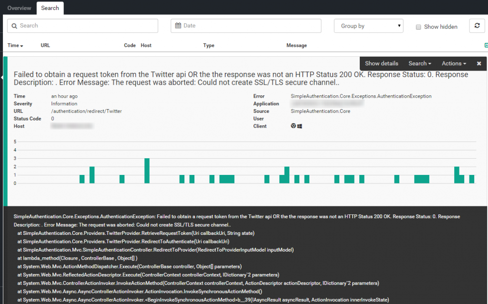

# Get better insights with the error occurence graph

##### [Thomas Ardal](http://elmah.io/about/), May 26, 2015 in [Tutorials](/category/tutorials/)

Ever had that feeling of déjà vu when looking through your logs? You drill down into the details on an error and think to yourself: I’ve seen this before!

In the latest release, we start to provide you with better insights into the errors logged from your website. First step involves the error details view, visible when expanding an error from the search view. With the improved error details view, you will be presented with a graph, showing the occurrence of the expanded error, in the entire retention period included in your current plan:



In this example, the AuthenticationException thrown inside the SimpleAuthentication package occurred multiple times during the last 90 days. The improved details view, will help you gain a better understanding of the error severity.

