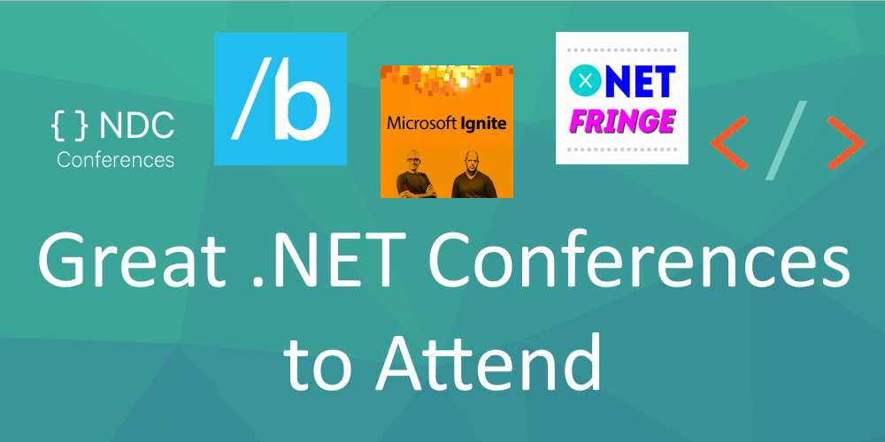

# Great .NET Conferences to Attend

####[Thomas Ardal](http://elmah.io/about/), December 15, 2017

Looking for .NET conferences to attend? You are in luck! There's a lot of options out there. While most good conferences about .NET are arranged by Microsoft themselves, there are some great alternatives spread across both Europe and the US. This list is my attempt to sum up a list of good conferences that I have had recommended by friends or attended during the years.

 

## <a href="https://ndcoslo.com/" target="_blank" rel="noopener noreferrer">NDC</a>

NDC or Norwegian Developers Conference is one of the largest .NET conferences in Europe. Launched in Oslo, Norway back in 2008, but now available in London, Sydney and Minnesota as well. Besides the main conferences, there's a NDC Mini in Copenhagen, that I attended and really enjoyed last year.

## <a href="https://build.microsoft.com/" target="_blank" rel="noopener noreferrer">//build/</a>

Back in 2011, Microsoft merged their PDC and MIX conferences into //build/. Besides a lot of info about .NET, there are always a lot of announcements too. So, if you want to be the first to hear about the new stuff, Build is the place to go.

## <a href="https://www.microsoft.com/en-us/ignite/" target="_blank" rel="noopener noreferrer">Microsoft Ignite</a>

Previously known as TechEd, Ignite is one of the oldest Microsoft conferences on the block. While TechEd were arranged all over the world, Ignite only seem to happen in the US. There's a lot of .NET content at Ignite, but the conference also spans other subjects. 

## <a href="http://buildstuff.lt/" target="_blank" rel="noopener noreferrer">Build Stuff</a>

Build Stuff, the large .NET conference in Lithuania, has been gaining a lot of traction the last years. It's amazing to see the quality of speakers, that the conference is able to attract. Some buddies of mine have attended the conference for a couple of years and speak very highly if going. A nice benefit of going to Lithuania is, that everything is cheaper than the rest of Europe and US. In 2017, Build Stuff introduced a new conference on Mallorca, Spain. Conference, pool and warm weather - what's not to like!

## <a href="https://vslive.com/home.aspx" target="_blank" rel="noopener noreferrer">Visual Studio Live</a>

Visual Studio Live is another Microsoft conference available in 7 US cities. The conference doesn't really seem to have gotten the attention it deserves. Looks like a range of good sessions with lots of hands on and workshops.

## <a href="https://www.dotnetconf.net/" target="_blank" rel="noopener noreferrer">.NET Conf</a>

.NET Conf is a virtual conference arranged by Microsoft every year. The awesome thing with .NET Conf is, that they partner with user groups and similar throughout the world, to arrange local in-person events like streaming sessions. Everything is free, which makes it a no-braining to convince your boss.

## <a href="https://techorama.be/" target="_blank" rel="noopener noreferrer">Techorama</a>

Techorama is one of the new players on the block. That shouldn't keep you from going though. In 5 years, Techorama has grown to more than 1.500 attendees and 150 sessions, spread across 11 tracks. Besides being a good choice for .NET developers, Techorama is held in the beautiful city of Antwerpen (Belgium) and from 2018 also in the Netherlands. Maybe combine it with a bit of sightseeing?

## <a href="https://global.azurebootcamp.net/" target="_blank" rel="noopener noreferrer">Global Azure Bootcamp</a>

Sort of like .NET Conf, but rather than streaming sessions from a virtual conference, Global Azure Bootcamp is a series of events throughout the world about Azure. The local user groups and MVPs arrange the conference and arrange which sessions to host and speakers to invite. Since this is organized 100% by local forces, I cannot recommend your local event or not. Try it next time or even better, ask to join in.

## <a href="https://anglebrackets.org/#!/" target="_blank" rel="noopener noreferrer">AngleBrackets</a>

Yet another Microsoft conference in US. Originally founded by Scott Hanselman and friends, after missing the MIX (now //build/) conference. AngleBrackets is like MIX, mostly about web and related technologies. It's one of those conferences that I would personally love to attend.

## <a href="http://dotnetfringe.org/" target="_blank" rel="noopener noreferrer">.NET/FRINGE</a>

.NET Fringe is an open source .NET conference located in Portland, Oregon. The awesome thing about Fringe is that it seems to be backed by a lot of cool people in the industry.

## <a href="https://www.microsoft.com/en-us/connectevent/default.aspx" target="_blank" rel="noopener noreferrer">Microsoft Connect();</a>

You cannot write a post about Microsoft .NET conferences without mentioning Connect();. It's a virtual conference with a lot of good stuff and announcements. All sessions are available for streaming, so catch a session or two before going to bed.

## <a href="https://mvp.microsoft.com/summit" target="_blank" rel="noopener noreferrer">MVP Summit</a>

You probably haven't heard about the summit if you haven't been a Microsoft MVP or tried to be one. It's the yearly event for all MVP's with a lot of insider information about new and exciting Microsoft technologies. I had one chance to attend (back in 2015), but blew it :)

## <a href="https://dotnext-piter.ru/en/" target="_blank" rel="noopener noreferrer">DotNext</a>

Eastern Europe doesn't only offer Build Stuff. DotNext is a two-day conference happening in Moscow and St. Petersburg (both Russia) every year. DotNext may not be the largest conference out there, but they still managed to attract speakers like Jon Skeet, Dino Esposito and Mark Seemann in 2018.

Do you believe we've missed something? Let us know through the comments below.