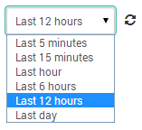
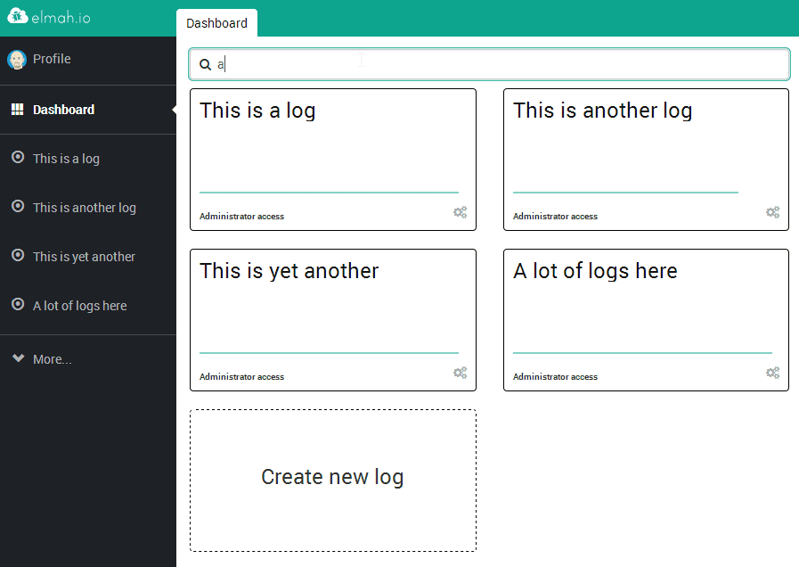
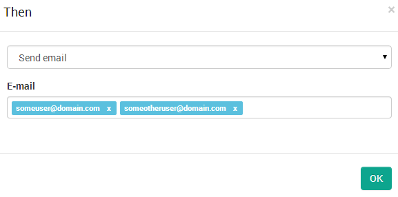
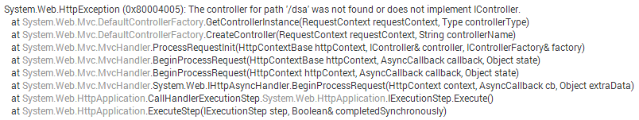

# Great new features for our paying customers

##### [Thomas Ardal](http://elmah.io/about/), August 12, 2014

## Time for another update on some of the amazing stuff we’ve build recently. This time we focused primarily on our paying customers, with a bunch of great new features and improvements.

### Time intervals and auto-refresh

We are really proud of our [redesigned](https://blog.elmah.io/say-hello-to-the-redesigned-overview/) log Overview. Guess what! The Overview just became even cooler. A couple of new controls in the top right now lets you show data from different intervals like “last hour”, “last 6 hours” and so on. But there’s more. Click the auto-refresh icon and the Overview will automatically refresh every 5 seconds. Time to put that page on a large wall mounted flat screen?



### Log Search
Since we [launched unlimited logs on all paid plans](https://blog.elmah.io/unlimited-logs-now-available-on-all-paid-plans/), you guys have been busy creating new logs. Even though having a lot of logs feels totally awesome, it may be hard finding the right one to click. That’s why we’ve implemented quick search on the dashboard:



### Send mails to multiple recipients
It may not be all of you who know this, but elmah.io contains one of the strongest query based rule engines on the [cloud logging](https://elmah.io/cloud-logging/) marked. You can write complex queries and execute various rules when new errors matching your query are logged. We’ve extended the email rule to let you send an error email to multiple email addresses:



### Inline .NET source browsing
That’s right! Browse the .NET types in stack traces directly from elmah.io. We utilize the new Roslyn based referencesource from Microsoft, to start building a new time saving feature. Ever wanted to click a type in the stack trace on a webpage? Well, now you can on elmah.io. We’ve started out adding support for types only, but namespaces, methods and more will follow:



Before we finish up, we just want to mention two more things. First up, we now support four additional credit card types (yes, AmEx is now supported). Secondly we want to mention our new [Visual Studio extension](https://blog.elmah.io/introducing-the-new-visual-studio-extension/) again. Please check it out.

As usual please don’t hesitate to contact us through [UserVoice](http://elmahio.uservoice.com/), [Twitter](https://twitter.com/elmah_io) or [Email](mailto:info@elmah.io)..


