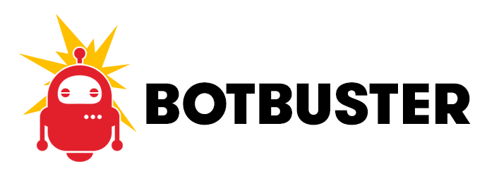

# Ignore Errors Generated by Bots

##### [Thomas Ardal](http://elmah.io/about/), May 13, 2016

You may not know the [elmah.io AppStore](https://elmah.io/appstore), but in fact we offer integrations with a range of commonly used services like Slack, GitHub and Zapier. Today I want to introduce you to our recent app, with the awesome name BotBuster.



If you've ever logged uncaught errors with ELMAH, you know that crawlers, bots, spiders and similar causes a lot of errors. Robots that parses your website and requests resources that may or may not exist, appending weird query parameters and other funky stuff, may cause your website to throw errors. You may want to see these errors in your log, but chances are that you don't. If you're the later, BotBuster is for you.

When enabled, BotBuster automatically ignores errors generated by a long list of known bots. This means that bots will still crawl your website as before, but any errors generated by bots, never hits your log. This makes it much easier for you to get an overview of your log and you don't need to deal with errors where no user is involved.

To enable BotBuster, go to your log settings, hit the Apps tab and install the BotBuster app.

If you're interested in the technology behind BotBuster, our founder (well that's me as well :) wrote a blog post about [how to analyze user agents to identify bots](http://thomasardal.com/analyzing-user-agents-to-identify-bots-with-elasticsearch/).