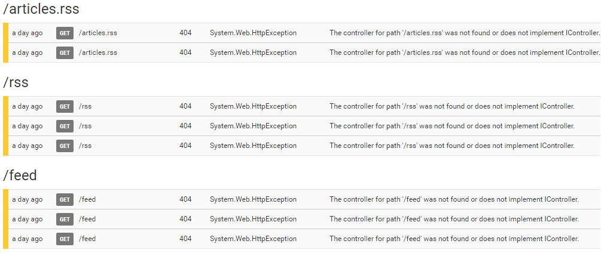
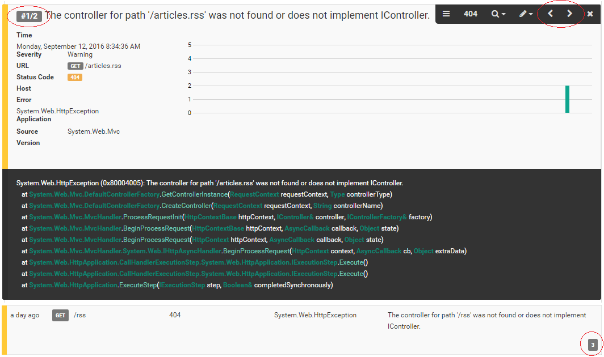

# Improved Message Grouping

##### [Thomas Ardal](http://elmah.io/about/), September 14, 2016

Getting an overview of your log can be hard with thousands of errors and log messages. Typically, a lot of your errors are the same happening over and over again. That's why we have had message grouping on elmah.io from the early days. The UI available for message grouping haven't been as crisp as the rest of the experience though. Take a look at how message groping looked like until recently:



In the example, I've grouped my warnings by URL which would still cause a long list of rows with nothing more than a headline added above all similar rows.

But we can do so much better and that's exactly what we've done. Take a look at the new messages grouping feature recently released:



Messages are now properly grouped in the UI as well, showing all similar messages within the same control. The counter located in the upper left corner shows which instance of the message you are currently looking at (within the expanded group). The navigation icons located in the upper right, makes it possible to navigate between instances to see differences like when the message where logged etc. The collapsed group located in the bottom of the screen, show a counter indicating how many messages that are in the group.

It's important for me to underline, that every single message is still saved as its own unit. We've seen error management systems similar to elmah.io which stores multiple instance of a message as a simple counter, making it impossible to see differences in cookies, server variables etc. With elmah.io, you get **everything** logged, giving you the best tools to hunt down bugs.

We hope that you will love the new grouping feature. We are getting ready to implement a better grouping algorithm, making it possible to create smart groups by looking at similar messages, rather than grouping on a single and exact value. Bulk actions on groups are something that we are looking into as well. If you would want to delete all instances of a specific error or ignore future messages in a group, bulk actions like this would be a huge help.