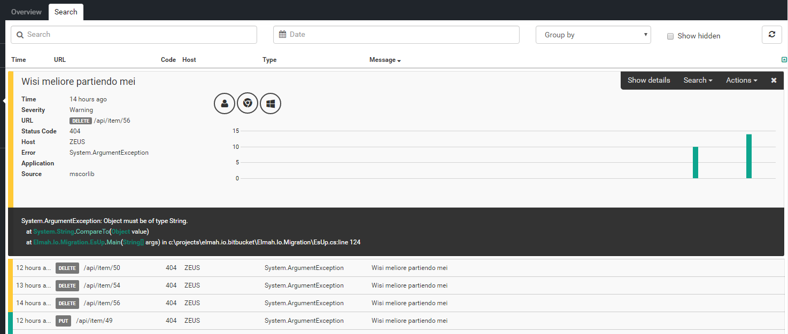
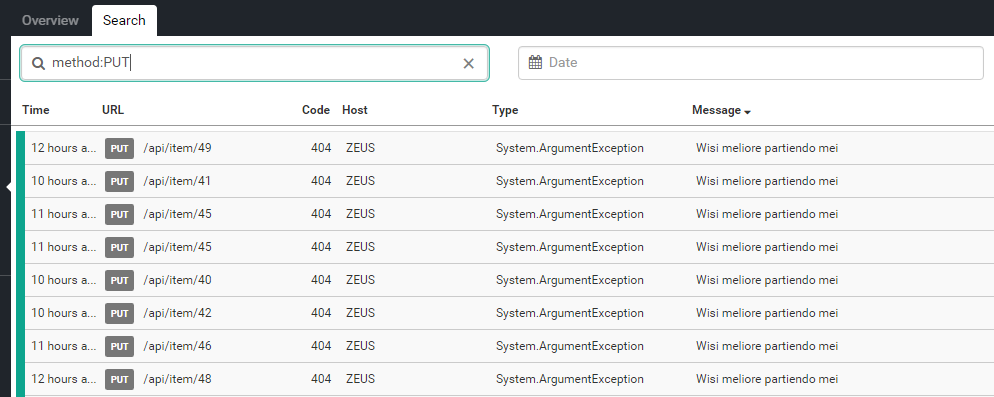

# Improvement #1 - HTTP method on URLs

##### [Thomas Ardal](http://elmah.io/about/), February 22, 2016
 
This is the first post in the series [10 improvements in 10 days](ten-improvements-in-ten-days.md). Today, we wanted to improve the way URLs are shown on elmah.io. When dealing with web sites (especially Web APIs), not only the URL of an error is important, but also the HTTP method. A single resource URL can have multiple allowed methods. To make it more visible which resource that actually failed, we give you HTTP method on URLs:



Notice the small label left of the URL in both the error details and the list? It may not look like much, but it makes a big difference when trying to get an overview on what's going on. Since HTTP method is now indexed in our Elasticsearch cluster as well, search for errors with a specific HTTP method is now possible:



Finally, creating rules and apps on top of HTTP method is also open for anyone up for the challenge.

Tomorrow, we will implement a minor but often requested improvement to elmah.io.


