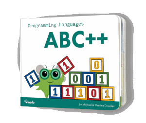
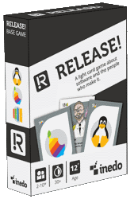

# Improvement #3 - Increased session timeout

##### [Thomas Ardal](http://elmah.io/about/), February 24, 2016

This is the third post in the series [10 improvements in 10 days](ten-improvements-in-ten-days). Yesterday we [increased session timeout](improvement-two-increased-session-timeout). Today, we are ready to present to new and fun products in the [elmah.io Goodie Bag](https://elmah.io/goodiebag).

### 40 % discount on Programming Languages ABC++



It's an alphabet book that aims to help us share what we do with the kids in our life, and spark children's interest in coding. The book follows the Bug, as it bumbles through the alphabet in colorful computer pun illustrations. Each page highlights a different language with a ‘Hello World’ program, and some factoids about the history of the language.

### 40 % discount on Release!



Release! is a lightly themed game set in the world of software development. Creating software takes time, skill, the right team, and hard work. Release is a little quicker, and a lot more fun. Modeled on school trick taking games, Release! puts a spin on classic sensibilities with new scoring mechanics each round, and powerful special cards featuring some familiar faces from the industry.



