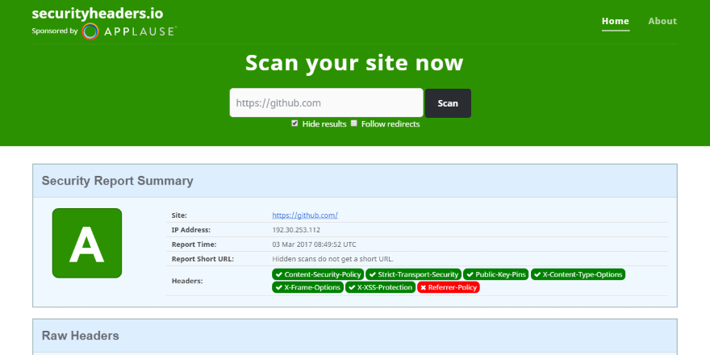

---
description: Improving the security in your ASP.NET MVC and Web API app is easy using custom headers and a bit of c#. Make it hard for hackers in just a few minutes.
image: images/securityheaders.png
booksignup: true
---

# Improving security in ASP.NET MVC using custom headers

##### [Thomas Ardal](http://elmah.io/about/), March 3, 2017

I recently discovered [securityheaders.io](https://securityheaders.io/), produced by the hyper productive Scott Helme. securityheaders.io scans your website and make suggestions to which HTTP response headers to add in order to improve security. I already use Troy Hunt's [ASafaWeb](https://asafaweb.com/), but that one has a slightly different focus and lacks some of the headers.



This post is a sum up of not only elmah.io headers added recently, but how to make it more difficult for hackers to compromise your ASP.NET (MVC, Web API, Core) website in general. In the following paragraphs, I have listed a number of HTTP headers that are easily configured and that everyone should implement.

## X-Frame-Options

The `X-Frame-Options` header ensure, that hackers don't iframe your site, in order to trick you into clicking links which you never intended to. If you are using ASP.NET MVC 5 or newer, this header is added automatically. Adding the header in previous versions or other web frameworks is easy using `web.config`:

```xml
<system.webServer>
  <httpProtocol>
    <customHeaders>
      <add name="X-Frame-Options" value="DENY" />
    </customHeaders>
  </httpProtocol>
</system.webServer>
```

In this example, I deny any possibility of iframing the website. If you are using iframes on the same domain, you can change the value to `SAMEORIGIN`.

## X-Xss-Protection

The `X-Xss-Protection` is a feature implemented in most modern browser, which will stop loading the page when a cross-site scripting attack is detected. Adding the header happens through `web.config` as well:

```xml
<system.webServer>
  <httpProtocol>
    <customHeaders>
      <add name="X-Xss-Protection" value="1; mode=block" />
    </customHeaders>
  </httpProtocol>
</system.webServer>
```

The value if `1` simply marks the protection as enabled.

## X-Content-Type-Options

To avoid MIME type sniffing, you can add the `X-Content-Type-Options` header. This makes it harder for hackers to guess the right mime type, by inspecting the content. Adding the header is easily done through `web.config`:

```xml
<system.webServer>
  <httpProtocol>
    <customHeaders>
      <add name="X-Content-Type-Options" value="nosniff" />
    </customHeaders>
  </httpProtocol>
</system.webServer>
```

## Referrer-Policy

Browsers automatically add the `Referer` header, when a user click a link on your site. This means that a linked website, will be able to see where the users are coming from. While this is a great feature for Analytics, you may have sensitive information in your URLs, which you don't want to forward to other domains. To remove the referrer entirely, add the following header to `web.config`:

```xml
<system.webServer>
  <httpProtocol>
    <customHeaders>
      <add name="Referrer-Policy" value="no-referrer" />
    </customHeaders>
  </httpProtocol>
</system.webServer>
```

In real life, you may want another value for `Referrer-Policy`. Removing the referrer entirely, makes it impossible to see the internal traffic flow on your website. Check out [Referrer-Policy on mozilla.org](https://developer.mozilla.org/en-US/docs/Web/HTTP/Headers/Referrer-Policy) for a list of possible values.

## X-Permitted-Cross-Domain-Policies

To restrict Flash components to make cross-origin requests, you should disable it entirely (unless you are using Flash of course). To do so, add the `X-Permitted-Cross-Domain-Policies` to `web.config`:

```xml
<system.webServer>
  <httpProtocol>
    <customHeaders>
      <add name="X-Permitted-Cross-Domain-Policies" value="none" />
    </customHeaders>
  </httpProtocol>
</system.webServer>
```

## Strict-Transport-Security

If you haven't implemented HTTPS on your website, you should. After doing so, you can prevent any communication happening over HTTP using the `Strict-Transport-Security` header:

```xml
<system.webServer>
  <httpProtocol>
    <customHeaders>
      <add name="Strict-Transport-Security" value="max-age=31536000; includeSubDomains" />
    </customHeaders>
  </httpProtocol>
</system.webServer>
```

The `max-age` value tells browsers to use this setting for the specified number of seconds. In this case a year. The `includeSubDomains` part can be excluded, if you are hosting non-HTTPS websites on subdomains (like a blog).

## X-Powered-By

The `X-Powered-By` header is automatically added by ASP.NET. To make it less obvious which technology you are using to host your website, you should remove this header through `web.config`:

```xml
<system.webServer>
  <httpProtocol>
    <customHeaders>
        <remove name="X-Powered-By" />
    </customHeaders>
  </httpProtocol>
</system.webServer>
```

## X-AspNetMvc-Version

Much like `X-Powered-By`, `X-AspNetMvc-Version` is a header automatically added by the framework. To avoid telling hackers that you use MVC and which version, you should remove it. `X-AspNetMvc-Version` cannot be removed through `web.config`, but you can disable it from code. Add the following to your `Startup.cs` or `Global.asax.cs`:

```csharp
MvcHandler.DisableMvcResponseHeader = true;
```

## Server

ASP.NET also reveals the server hosting the application. If a hacker know that you are using IIS, this narrows the number of weaknesses that he/she needs to try. To remove the `Server` header, remove it from code in either a filter or through `Global.asax.cs`:

```csharp
protected void Application_PreSendRequestHeaders()
{
    if (HttpContext.Current != null)
    {
        HttpContext.Current.Response.Headers.Remove("Server");
    }
}
```

## Content-Security-Policy

Using the `Content-Security-Policy` header, requires a bit more explanation. Check out the next post in this series for details: [Content-Security-Policy in ASP.NET MVC](https://blog.elmah.io/content-security-policy-in-asp-net-mvc/)