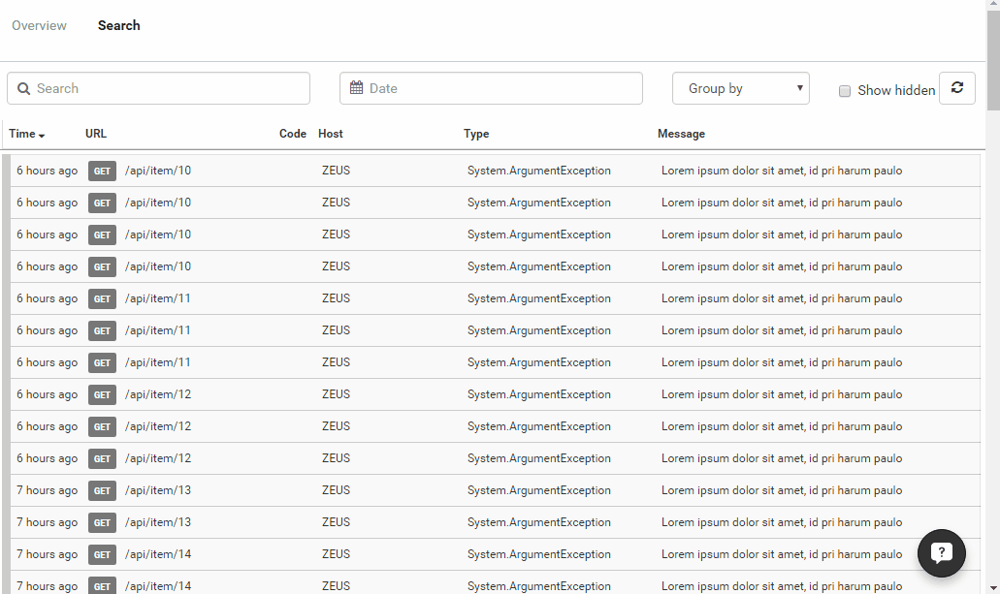

# Infinite Scroll (Well Almost)

##### [Thomas Ardal](http://elmah.io/about/), August 1, 2016

Like a lot of people, we have been celebrating the nice concept of vacation during the last couple of weeks. Well sort of, since the support is always open. We hope that you've all had a nice vacation with great experiences, spending time with your families and of course lots of code!

Today, we have launched a highly requested feature: infinite scroll on the search page. In fact we chose not to implement it as true infinite scroll, but as a "Show more" button to make it explicit whether or not you want additional search results added to the list:



As always, we would love to get your feedback on this new feature. Please use the comments section below or contact us through intercom with feedback, bug reports, features requests or if you want to discuss TV shows :)