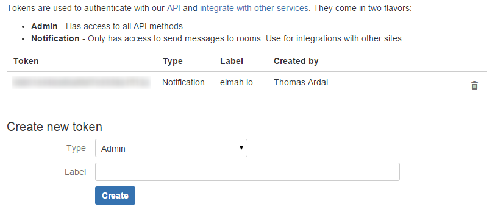
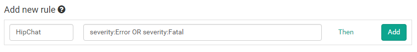
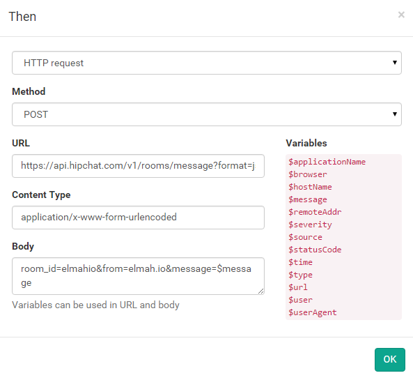
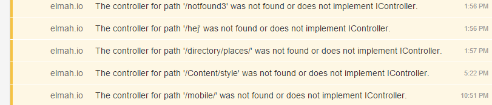

# Integrate elmah.io with HipChat

##### [Thomas Ardal](http://elmah.io/about/), June 11, 2015 in [Tutorials](/category/tutorials/)

> This post has been adapted as part of our official documentation. To read the most updated version, please check out [Integrate with HipChat](http://docs.elmah.io/integrate-elmah-io-with-hipchat/).

We took a decision early on, to spend our time working on the core product. This means that you will not find 100 different kinds of integrations on elmah.io. We do integrate with Zapier, but in this post I will show you how to integrate elmah.io with HipChat using the Business Rule feature.

Before we dig into the details of elmah.io, you should sign up or log into [HipChat](https://www.hipchat.com/). Create a new room for your team and go to the [API page](https://elmahio.hipchat.com/admin/api). Create a new token with the Notification type and label it something meaningful:



We will need the generated token in a minute, so keep that tab open.

On elmah.io, go to the Rules tab beneath your log settings. In this example we want a message on HipChat every time a new error is logged in our elmah.io log. To do this, name your rule and input a query like illustrated on the following screenshot:



Hit the _Then_ link and select HTTP request. Input the following values (remember to replace YOUR_TOKEN and YOUR_ROOM):

| Field | Value |
| :--- | :--- |
| Method | POST |
| URL | https://api.hipchat.com/v1/rooms/message?format=json&auth_token=YOUR_TOKEN |
| Content Type |application/x-www-form-urlencoded |
| Body | room_id=YOUR_ROOM&from=elmah.io&message=$message | 

The final result should look like this:



Click the OK button and add the new rule by clicking Add. This configuration tells elmah.io, to make a HTTP request against the HipChat API, every time a new error is logged. The message at elmah.io is shown as the chat message inside HipChat:


