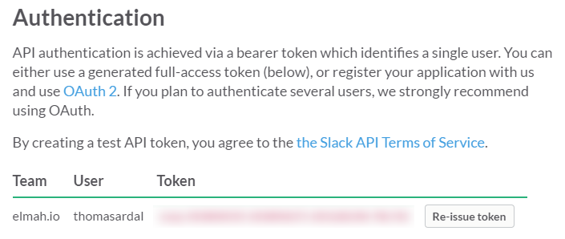
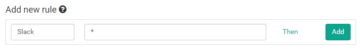
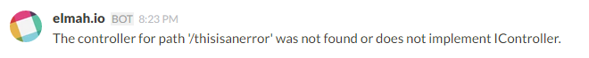

# Integrate elmah.io with Slack

##### [Thomas Ardal](http://elmah.io/about/), June 18, 2015

> This post has been adapted as part of our official documentation. To read the most updated version, please check out [Integrate with Slack](http://docs.elmah.io/integrate-elmah-io-with-slack/).

Last week, we showed you how to [integrate elmah.io with HipChat](integrate-elmah-io-with-hipchat.md). This week we take a look at another popular tool for team communication: Slack. Like HipChat, Slack offers an API, making it easy to integrate with elmah.io through the Rules feature.

Start by copying your Slack-token from the [API page](https://api.slack.com/web). We will need this when setting up the integration.



On elmah.io, go to the Rules tab beneath your log settings. In this example we want a message on Slack every time a new error is logged in our elmah.io log. To do this, name your rule and input a query like illustrated on the following screenshot:



Hit the Then link and select HTTP request. Input the following values (remember to replace YOUR_TOKEN and YOUR_CHANNEL):

| Field | Value |
| :--- | :--- |
| Method | POST |
| URL | https://slack.com/api/chat.postMessage?token=YOUR_TOKEN&channel=YOUR_CHANNEL&text=$message&username=elmah.io |

The final result should look like this:



Click the OK button and add the new rule by clicking Add. This configuration tells elmah.io, to make a HTTP request against the Slack API, every time a new error is logged. The message at elmah.io is shown as the chat message inside Slack:





