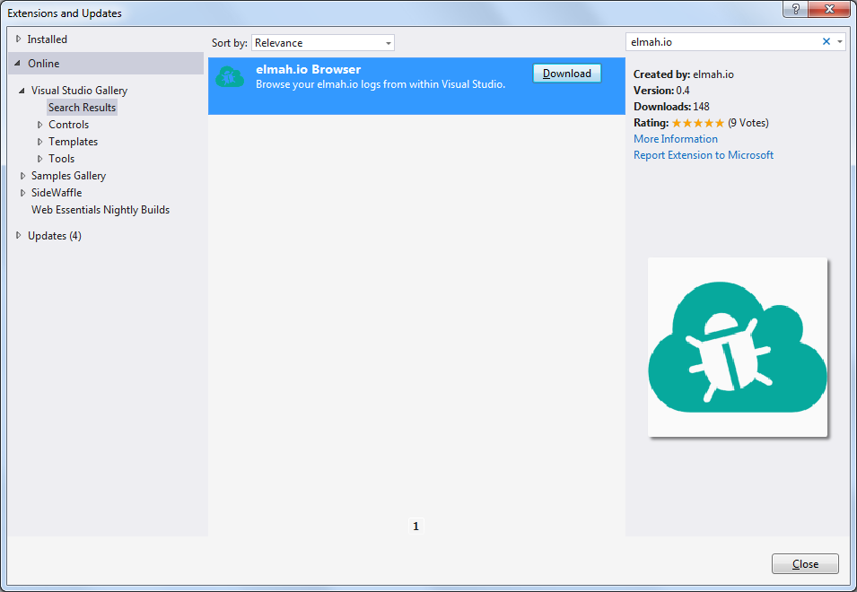
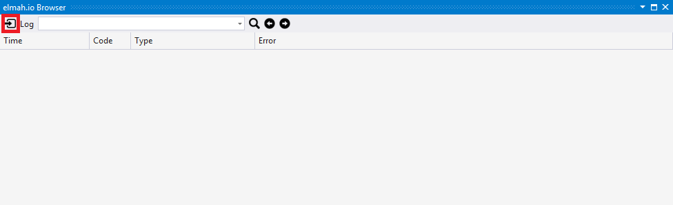
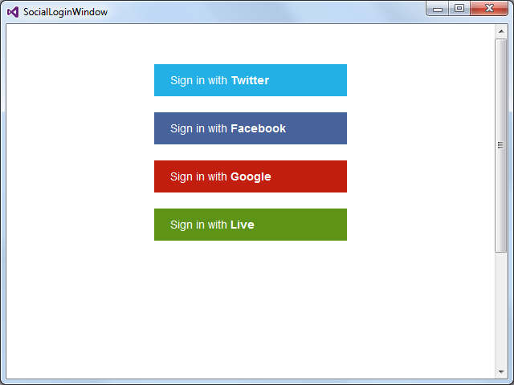
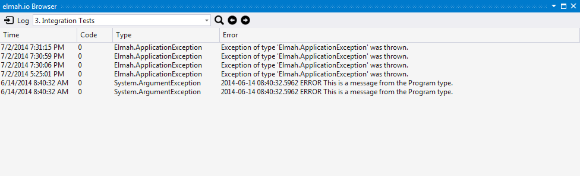

# Introducing the new Visual Studio extension

##### [Thomas Ardal](http://elmah.io/about/), July 03, 2014

## Finally, we are ready to unveil what we have been working on (among a lot of other stuff) the last weeks. Please welcome the elmah.io Browser – our new Visual Studio extension!

Like you, we are using elmah.io to track errors on our websites (including elmah.io). We spend almost all of our day inside Visual Studio coding, why integrating error logs inside our favorite IDE was an obvious choice. Let me show you how to get up and running.

1. Inside Visual Studio navigate to Tools | Extensions and Updates | Online and search for elmah.io: 


2. Hit Download and restart Visual Studio.

3. You’ll find the elmah.io Browser through View | Other Windows | elmah.io Browser or by searching for it through Quick Launch (Ctrl+Q).

4. When launched, a new tool window appears, which can be docked if you’d like. To start browsing your logs, hit the log in icon to the left: 


5. Log in with the social account used on elmah.io: 


6. When logged on, the Log combo box contains a list of your logs. Select one and hit the search icon: 


There you go: full elmah.io log browsing support inside VS. You can double click each row and check out the details directly on the elmah.io website.

We have a lot in store for the extension. But as usual we’d love your feedback so please try out the extension and get back to use through [UserVoice](http://elmahio.uservoice.com/), [Twitter](https://twitter.com/elmah_io) or [Email](mailto:info@elmah.io) or the [elmah.io Browser details page](http://visualstudiogallery.msdn.microsoft.com/0225db2a-9074-45eb-a4be-d1cf42d6a94d) on the Visual Studio gallery.


