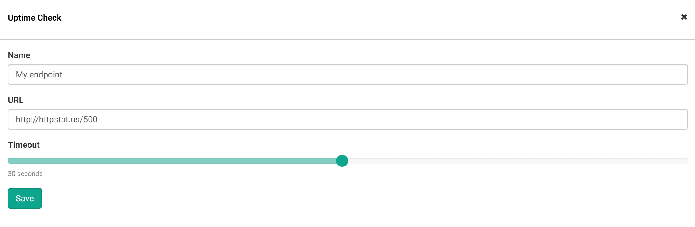
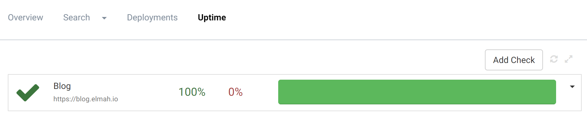
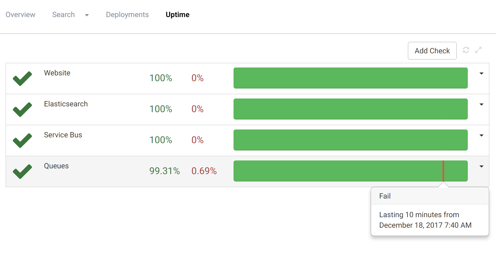
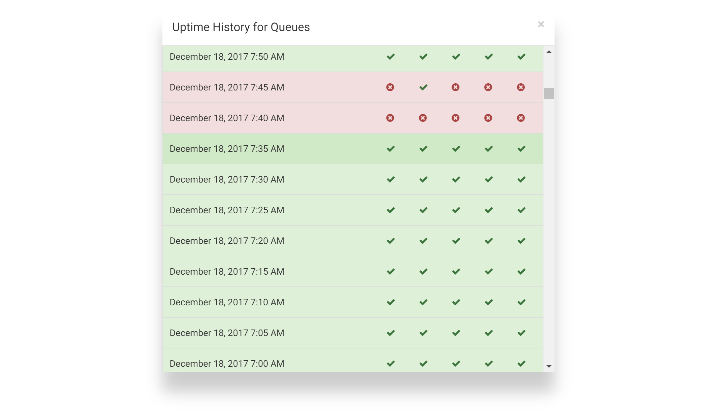
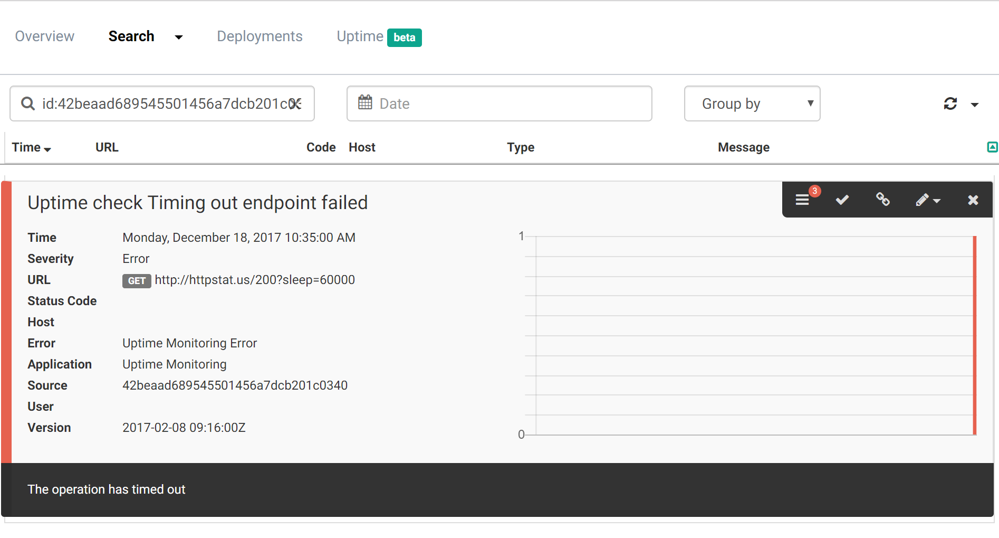
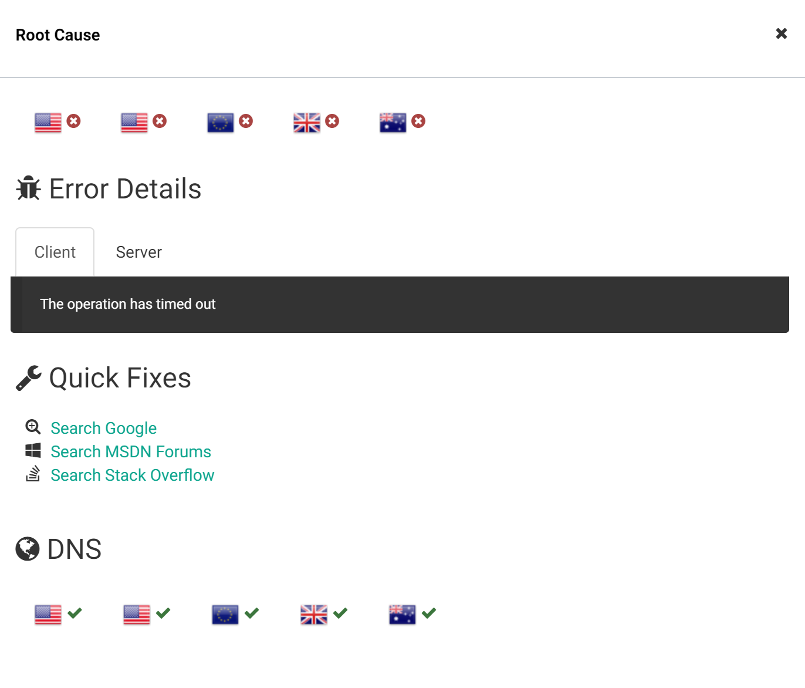
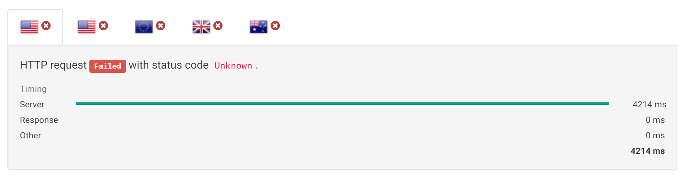
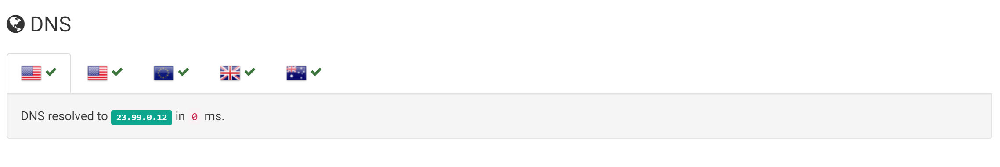

# Introducing Uptime Monitoring

##### [Thomas Ardal](http://elmah.io/about/), January ?, 2018

Something struck me back in December. We've written a lot about the new Uptime Monitoring feature on the blog, our newsletter and more. But we never actually introduced the new system as a whole (which probably just shows that we are more nerds than business men :). So, either forget everything you have ever heard about elmah.io Uptime Monitoring or read through this post to learn all the details.



### The Challenge

In order to develop quality software, you will need some kind of error management strategy. You may log your errors in local log files or use a system like elmah.io. The important thing is that you get errors logged, are notified about errors happening (before your customers start calling) and fix errors fast. Errors are typically caused by users invoking a feature on your website that either fails or doesn't exist. elmah.io have always been a great solution for catching errors like this.

But you are not safe yet. Your website may not even be serving client requests. This could be caused by a failing webserver, DNS issues, invalid SSL certificates and much more. In these cases, the client requests never reach your webserver and elmah.io doesn't log any errors in your error log.

### The Solution

I'm happy to introduce you to the solution to this problem: elmah.io Uptime Monitoring. With Uptime Monitoring, we automatically request one or more endpoints of your choice every 5 minutes.

Adding new uptime checks is available on the Uptime tab on your existing error log. Click the Add button in the top right and fill in the details:



When saved, elmah.io will start requesting the inputted endpoint from 5 different locations every 5 minutes. Requesting from multiple locations ensure, that we catch misconfigured DNS and a range of other scenarios.

On the Uptime tab, you will see an updated picture of the last 24 hours:



In this case, the configured endpoint (this blog) have been up 100 % of the time. In cases where your endpoint has downtime, red areas are shown on the graph. If you hover the area, you will see details about the failing period:



For the full details, you can click the arrow down right of the graph and select _History_:



### Log Integration

We didn't actually show you anything not achievable with similar uptime robots like Pingdom. There are multiple benefits of combining Error Management with Uptime Monitoring. The biggest benefit is, that both features are gathered in the same tool. Uptime errors are stored in your current error logs alongside errors logged from your applications. The nice thing about this, that all the notification rules already configured works with Uptime Monitoring as well. No need to manage your team and notification rules in multiple tools.

When clicking an uptime error on the history popup, you are brought to the error details:



As with other errors, elmah.io show you all the details needed to understand what is going on. In the screenshot above, the configured endpoint time out.

For even more details about an uptime error, you can click the details button. For uptime errors, we have introduced an alternative view to the normal details UI (showing cookies, server variables etc.). We call this the Root Cause view:



In this view, you are presented with the results from each region. Detailed timing information from each zone, is available by clicking one or more flags:



The _Error Details_ section show you diagnostics information from both the client and the server. That's right! We potentially also show the server-side of this error. This is a unique feature of elmah.io Uptime Monitoring, which you only gain my combining server side logging with uptime checks.

In the bottom, we show if there are problems resolving the endpoint hostname in one or more regions. Like the timing information in the top, you can click each flag to see which IP is resolved in the clicked region, as well as the performance of the DNS lookup:



There you go. That's the basics of the new Uptime Monitoring feature. Uptime Monitoring is available in the Business plan and up. Check out our [plans and pricing](https://elmah.io/pricing/) page for more details.