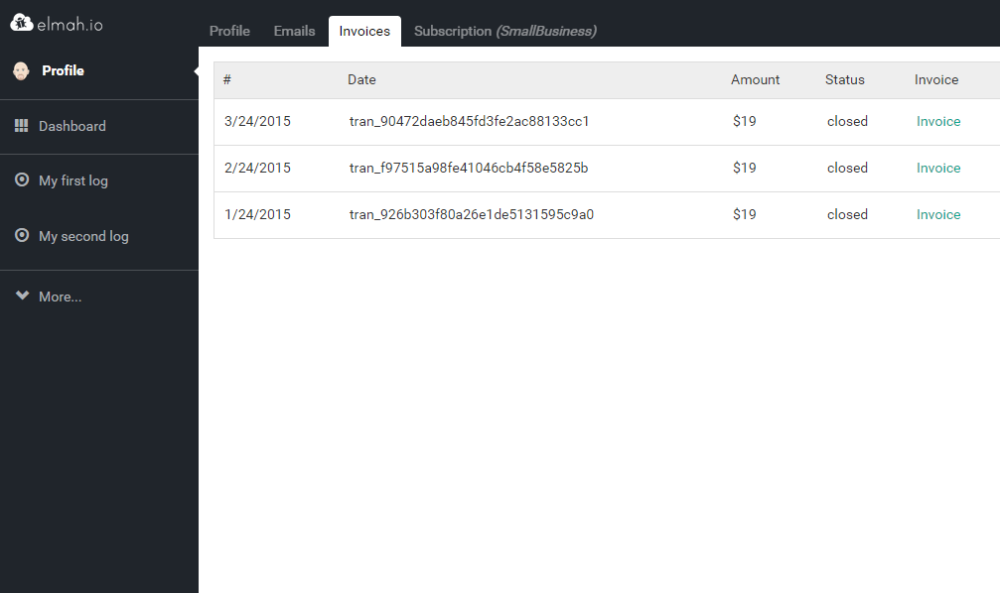
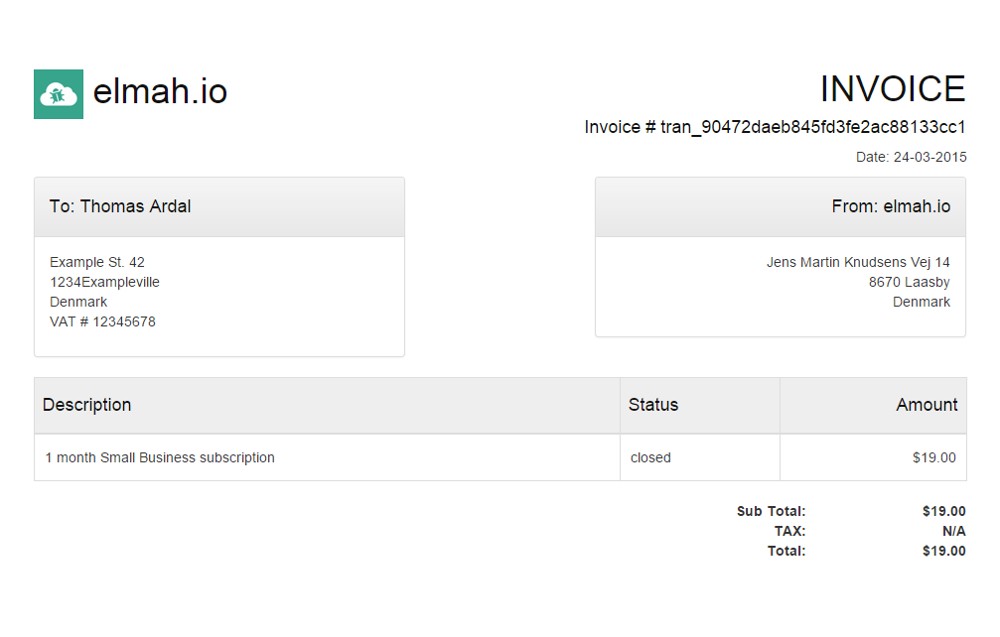

# Invoicing

##### [Thomas Ardal](http://elmah.io/about/), April 15, 2015 in [Tutorials](/category/tutorials/)

One of the most requested features of elmah.io, actually have nothing to do with logging: Invoicing. A lot of our paying customers asked us for invoices, why we’ve implemented just that in the latest release of elmah.io.

Invoices really have nothing to do with elmah.io, but it makes your accountant a happy camper. Beneath your profile, a new Invoices tab can be found. This tab shows you a list of invoices for all your successful payments:



Clicking an invoice, opens the selected invoice in a new window:



Invoices are available for all our corporate accounts (Small Business, Business and Enterprise). We hope that we with this change, can make your accountants stop bugging you for documentation.
