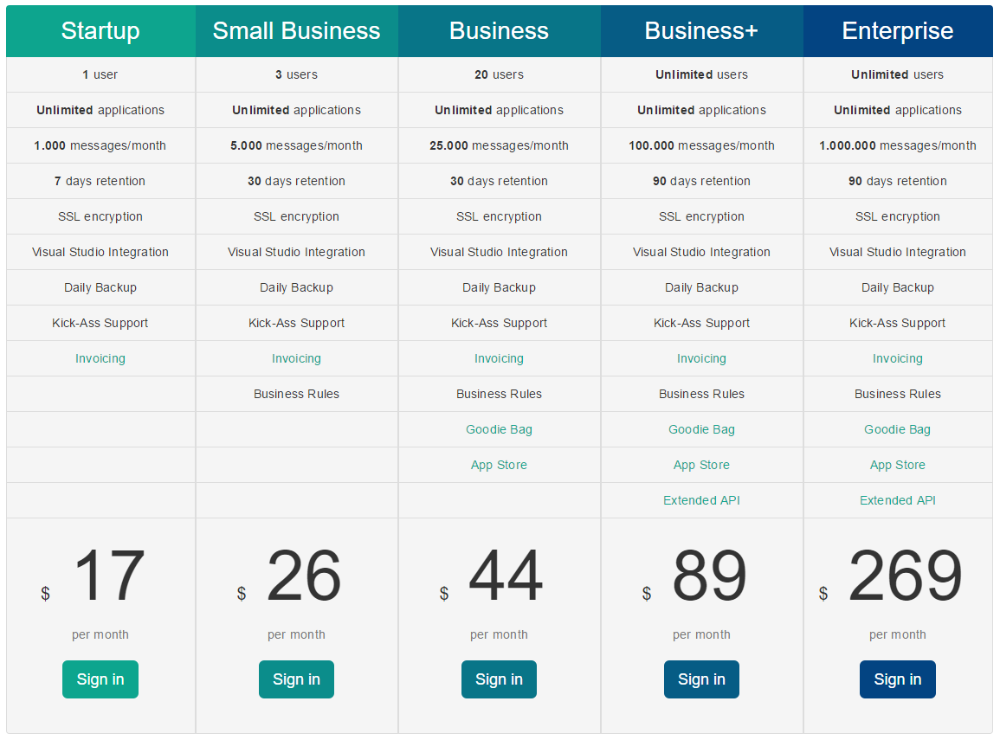

# Larger plan available

##### [Thomas Ardal](http://elmah.io/about/), December 14, 2016

If you look back on some of the old posts on this blog, you will notice that we have never been afraid to shake things around when it comes to our plans and pricing. Today it is time for yet another change. While the Enterprise plan include 100k monthly messages, a common request from some of our larger customers have been "more storage, please". With today's change, we are ready to honour that request.

What we did was to create a plan capable of storing more errors than the currently largest plan called _Enterprise_. Since we would still like our largest offering to be called _Enterprise_, we have simply renamed (`CTRL+R+R`) the _Enterprise_ plan to _Business+_. Users already on the _Enterprise_ are now on _Business+_, but nothing else than the name changed. This means that the new _Enterprise_ plan now offers even more storage. The set of features on _Business+_ and _Enterprise_ are exactly the same, besides the allowed number of messages per month.

Here's an overview of our new plans:

