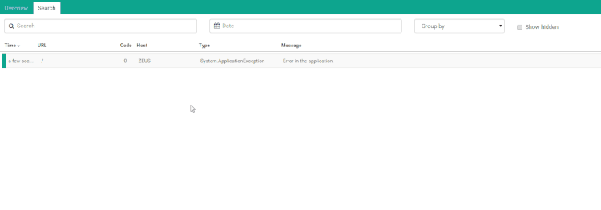

# Logging custom data to elmah.io

##### [Thomas Ardal](http://elmah.io/about/), February 24, 2015

> This post has been adapted as part of our official documentation. To read the most updated version, please check out [Logging custom data](http://docs.elmah.io/logging-custom-data/).

Time for a new feature which a lot of you’ve asked for either on elmah.io or ELMAH in general: logging custom data.

ELMAH stores a lot of contextual information when an error occur. Things like cookies, stacktrace, server variables and much more are stored to ease debugging the error at a later point in time. Since the schema of ELMAH is defined by the people behind ELMAH itself, there’s no really good way of enriching an error with custom variables. Until now! In the latest [prerelease](http://www.nuget.org/packages/elmah.io/2.0.17-beta) of the new v2 elmah.io client, you can add custom variables to an error, before it is send off to elmah.io’s API.

Let’s look at some code. You have two options of decorating your errors with custom variables.

### Use the [Data](https://msdn.microsoft.com/en-us/library/system.exception.data%28v=vs.110%29.aspx) dictionary on .NET’s Exception type

I talk to a lot of developers and not all of them know about the wonderful world of the Data dictionary. All exceptions in .NET contains a property named Data and of type IDictionary. The Data dictionary is intended for user-defined information about the exception. The elmah.io client iterates through key/values in this dictionary and ship it off to elmah.io’s API. To log custom data using Data, just add a new key/value pair to the Data dictionary:

```csharp
try
{
    CallSomeBusinessLogic(inputValue);
}
catch (Exception e)
{
    e.Data.Add("InputValueWas", inputValue);
    ErrorSignal.FromCurrentContext().Raise(e);
}
```

In the example I add a custom variable named ```InputValueWas``` with the value of the ```inputValue``` variable. This way I will be able to see which input value caused the exception.

### Use the OnMessage hook in the elmah.io client prerelease

You may not use ELMAH’s ErrorSignal feature, but rely on ELMAH to log uncaught exceptions only. In this scenario you probably don’t have access to the thrown exception. The elmah.io client offers a hook for you to be able to execute code every time something is logged:

```csharp
Logger.OnMessage += (sender, args) =>
{
    if (args.Message.Data == null) args.Message.Data = new List<Item>();
    args.Message.Data.Add(new Item { Key = "SomeOtherVariable", Value = someVariable });
};
```

You may not have seen the Logger type of elmah.io before, but what’s important to know right now is, that Logger is responsible for logging messages to the elmah.io API. Another new term here is Message. A message is the type encapsulating all of the information about the thrown exception.

In the code example I subscribe a new event handler to the ```OnMessage``` event. This tells the elmah.io client to execute your event handler, before actually logging an exception to elmah.io. I use the event to add a custom variable to the Data dictionary of the message logged to elmah.io.

### Looking at your custom variables

Logging custom data doesn’t really make anything easier, unless you have a place to show them. Luckily for you, we have thought about that and now offers a new tab on the error details:



Like the content in the other tabs of the error details, you will be able to filter results by the variable key.


