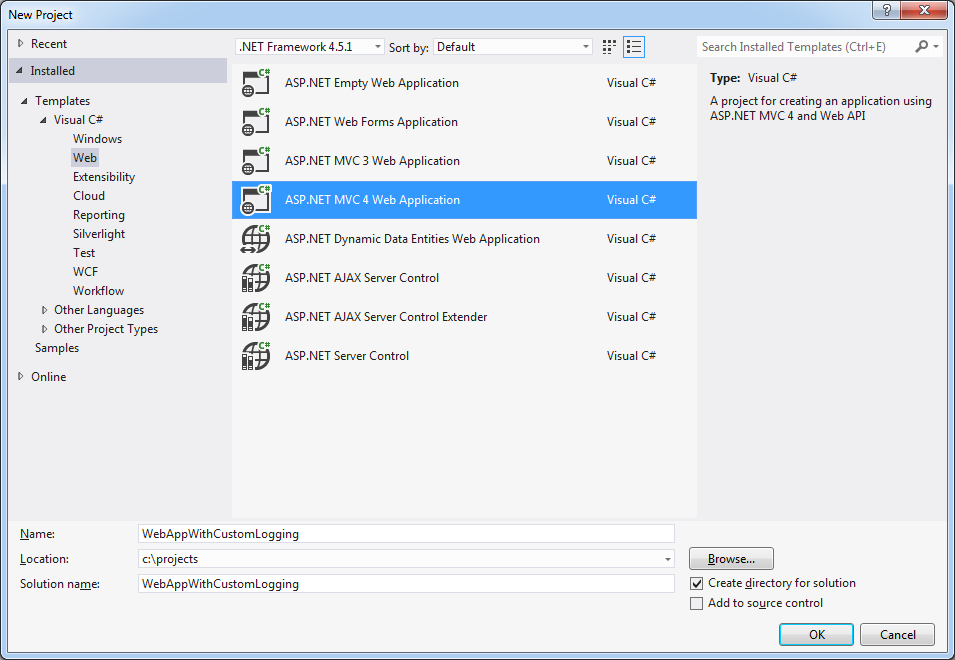

# Logging custom errors to elmah.io

##### [Thomas Ardal](http://elmah.io/about/), September 17. 2013

Some of you may be thinking: “I want to use elmah.io to log some custom errors, but I don’t want to configure ELMAH to log every error on my webserver. Can this be done?” The answer is of course: Yes! The elmah.io NuGet package has some tricks up its sleeve, making it not only an ErrorLog implementation for ELMAH, but also a client you can utilize in your .NET applications. Let me show you how by using a simple example:

Create a new ASP.NET MVC project:



Install the elmah.io NuGet package:

```powershell
Install-Package elmah.io
```

Add the following code to ```HomeController.cs```:

```csharp
using System;
using System.Web.Mvc;
using Elmah;
using ErrorLog = Elmah.Io.ErrorLog;
 
namespace WebAppWithCustomLogging.Controllers
{
    public class HomeController : Controller
    {
        private readonly ErrorLog _errorLog;
 
        public HomeController()
        {
            _errorLog = new ErrorLog(
                new Guid("REPLACE WITH YOUR LOG ID"));
        }
 
        public ActionResult Index(int dividend, int divisor)
        {
            var result = 0;
            try
            {
                result = dividend / divisor;
            }
            catch (Exception e)
            {
                _errorLog.Log(new Error(e));
            }
 
            return View(result);
        }
    }
}
```

In the constructor we create a new instance of the ```ErrorLog``` class from the ```Elmah.Io``` assembly. The class contain multiple constructors, but if you want to use elmah.io for custom logging, pick the one accepting your Log Id (found at the dashboard on elmah.io). In line 27 we need to log the exception when the division throws an exception. This is done using the ```Log``` method of the ```ErrorLog``` class.

```ErrorLog``` also provides methods for extracting both single and multiple errors from elmah.io.
